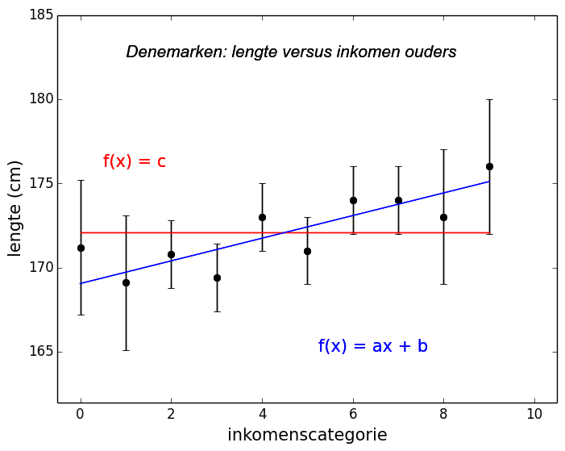
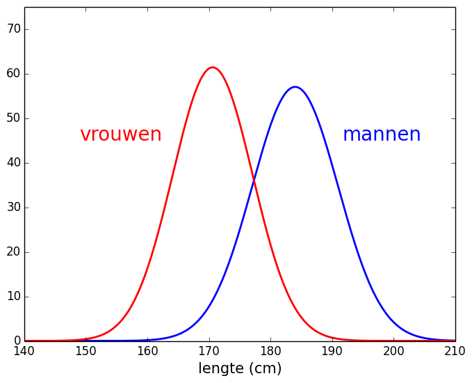
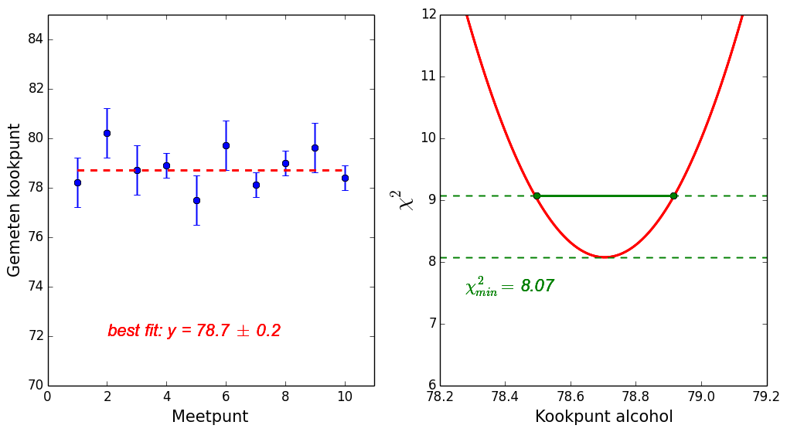
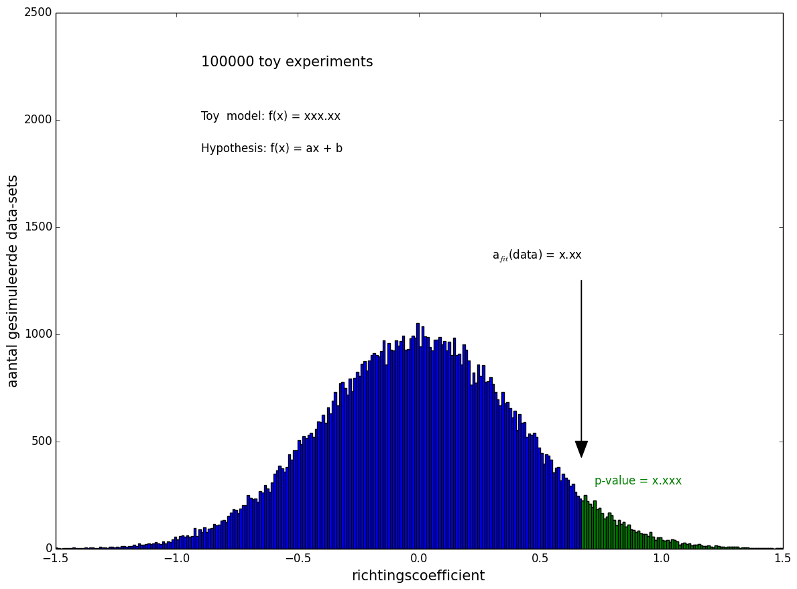
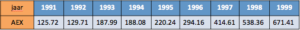

# Statistiek #

Als er een onderdeel is dat studenten van verschillende opleidingen verbindt is het wel de 
vrees voor (het gebrek aan kennis over) statistiek. En toch is het in elke wetenschappelijke 
discipline een cruciaal onderdeel omdat het de sleutel is tot het trekken van conclusies uit 
verzamelde gegevens. Wat is de 'waarheid' die verborgen ligt in de data en hoe kunnen 
verschillende hypotheses tegen elkaar afgewogen worden. In deze module zullen we aan de 
hand van een verzonnen casus een paar van de meest voorkomende technieken bekijken.

{:.inline}{: style="width:35%"}

**De casus:** In Denemarken is een onderzoeksgroep gaan bestuderen of de lengte van vrouwen 
gecorreleerd is met het inkomen van hun ouders. De inkomenscategorieen lopen van 
categorie-0 (zeer arm) tot categorie-10 (zeer rijk) en in elke categorie is een willekeurig 
aantal vrouwen geselecteerd van wie de lengte is gemeten. De data, de gemeten gemiddelde lengte 
voor elke inkomenscategorie is weergegeven in de grafiek hiernaast. En hier beginnen de problemen.
Een deel van de onderzoekers vindt dat de data suggereert dat er een duidelijk lineair 
verband te zien is (blauw) terwijl een andere groep vindt dat er helemaal geen afhankelijkheid 
is (rood). Die laatste groep zegt dat de geobserveerde lichte afhankelijkheid gewoon het resultaat 
van de toevallige fluctuaties in de lengte van vrouwen die in de steekproeven geselecteerd zijn. 

We gaan in deze module na een paar korte inleidende oefeningen proberen te achterhalen welke 
conclusies we kunnen trekken: is er nou wel of niet een afhankelijkheid ?

Hoewel het niet de bedoeling is van deze module om een volledig statistiek college te verzorgen 
zullen we er niet aan ontkomen om naast een aantal nieuwe Python ingredienten ook wat statistiek 
te introduceren in de voorbereiding op een opdracht.
 
## Opdracht 1: percentage vrouwen dat langer is dan de gemiddelde man

In de eerste opdracht zullen we in detail gaan bekijken naar het percentage vrouwen in Nederland dat 
erg lang is. Voor deze opdracht is het concept normaalverdeling en het manipuleren daarvan in Python 
van cruciaal belang.

#### [statistiek info voor opdracht 1]  de normaalverdeling 

In de natuur komt overal variatie voor: de lengte van mensen in een land, of het gewicht van 
dieren in een populatie om er maar een paar te noemen. De verdeling die de relatieve frequentie 
beschrijft waarmee een specifieke waarde $$x$$ voorkomt in de populatie van metingen wordt beschreven 
volgens de zogenaamde normaalverdeling:

$$ f(x,|\mu,\sigma) = \frac{1}{\sigma\sqrt{2\pi}} exp^{-\frac{1}{2}\left( \frac{x-\mu}{\sigma} \right)^2}$$

{:.inline}{: style="width:35%"}

Deze verdeling, ook wel de Gaussische distributie genoemd, wordt gekarakteriseerd door maar 
twee parameters: het gemiddelde ($$\mu$$) en de maat voor de spreiding ($$\sigma$$). Er geldt 
dat ongeveer 68%(95%) van de waarden in het gebied $$\mu \pm 1\sigma$$ ($$\mu \pm 2\sigma$$) ligt.

De lengte van mannen (vrouwen) in Nederland wordt bijvoorbeeld beschreven door een 
normaalverdeling met een gemiddelde $$\mu$$ = 184.0 (170.6) cm en breedte 
$$\sigma$$ = 7.0 (6.5) cm. De (genormeerde) grafieken van de twee verdelingen staan 
in grafiek hiernaast. Dit betekent dat 34% van de mannen langer is dan 191 cm en dan 
2.5% van de vrouwen kleiner is dan 157.6 cm.

 

#### [Python info voor opdracht 1] random getallen uit een normaalverdeling 

We hebben eerder gezien hoe je een random getal trekt in Python tussen 0 en 1. Het is ook mogelijk 
om een random getal te trekken uit een bepaalde verdeling. Omdat de normaalverdeling zo'n prominente 
plek inneemt is daar een standaard functie voor in Python (in de `numpy` bibliotheek) met de volgende 
syntax:

{: .language-python}
    gemiddelde = 170.6
    breedte = 6.5
    lengte = numpy.random.normal(gemiddelde,breedte)

Als je dit heel vaak herhaalt zullen de waardes van $$x$$ verdeeld zijn volgens de rode grafiek 
hierboven.

#### Opdracht 1: verdeling lengtes van alle vrouwen

Schrijf een programma `statistiek_opdracht1.py()` waarin je 1 miljoen random getallen trekt uit de 
normaalverdeling die de lengte van vrouwen in Nederland beschrijft. Maak een grafiek van 
al deze random lengtes. Gebruik hiervoor een histogram met bins die elk een breedte van 
0.5 cm hebben. Hou bij het trekken van de random lengtes bij hoeveel vrouwen een lengte 
hebben die groter is dan die van de gemiddelde man. Print aan het eind van het programma 
dit percentage lange vrouwen met 2 decimalen nauwkeurigheid.

{: .language-python}
    Het percentage lange vrouwen (langer dan 184 cm) is X.XX procent

## Opdracht 2: hoe representatief is een steekproef

In de echte wereld kunnen we vaak helaas niet alles weten. We kunnen niet van elke vrouw in Nederland 
precies achterhalen hoe lang ze is, net zoals Maurice de Hond niet van elke Nederlander weet 
op welke politieke partij hij of zij zal stemmen. We kunnen wel met behulp van steekproeven 
proberen een idee te krijgen van de hele populatie: we bepalen de lengtes van een groep 
vrouwen of de politieke voorkeuren van een groep Nederlanders en maken daarmee een schatting 
van de eigenschappen van de volledige populatie. 

We gaan in deze opdracht onderzoeken hoeveel nauwkeuriger de schatting van het 'echte' gemiddelde 
is bij een toenemend aantal mensen in de steekproef door met behulp van de computer nep-steekproeven 
te nemen uit de oorspronkelijke distributie. Door van deze steekproeven de gemiddelde lengte te 
bekijken van een (steeds grotere) groep representatief is voor die van de hele populatie. 

#### Opdracht 2: impact van meer metingen op de nauwkeurigheid

Schrijf een programma `statistiek_opdracht2.py` dat uitrekent welk percentage van groepen vrouwen 
(steekproeven) meer dan 5 cm afwijkt van het echte gemiddelde (170.6 cm). Doe dit voor 
verschillende groottes van de steekproef: $$N=2,3,5,10,100$$. 

Volg voor het bepalen van de fractie voor een specifieke waarde van $$N$$ het volgende 
stappenplan:

  - Trek N random waardes uit de oorspronkelijke verdeling: een steekproef
  - Bepaal voor elke steekproef het gemiddelde van de lengtes van de vrouwen 
    in die groep en bewaar die. 
  - Herhaal dit voor een groot aantal steekproeven (100000 bijvoorbeeld)
  - Hou bij in hoeveel steekproeven het gemiddelde meer dan 5 cm afwijkt 
    van het 'echte' gemiddelde (170.6 cm).
    Let op: we bedoelen hier zowel groter dan 175.6 cm en kleiner dan 165.6 cm.
              
Print de percentages op het scherm en gebruik 2 decimalen:
{: .language-python}
    Fractie afwijkende steekproeven voor N =   2: x.xx procent 
    Fractie afwijkende steekproeven voor N =   3: x.xx procent 
    Fractie afwijkende steekproeven voor N =   5: x.xx procent 
    Fractie afwijkende steekproeven voor N =  10: x.xx procent 
    Fractie afwijkende steekproeven voor N = 100: x.xx procent 

Extra: probeer de user te helpen door de getallen netjes uitgelijnd onder elkaar op het scherm te krijgen

Het is zeer inzichtelijk om de distributies van de gemiddeldes te bekijken voor de verschillende 
keuzes van de steekproefgrootte. Gebruik hiervoor de histogram methode die we ook in opgave 1 
gebruikt hebben. Kies zelf een geschikte bin-grootte.

**Conclusie:** Hoe groter de steekproef hoe beter het gemiddelde daarvan de 'echte' waarde 
benadert. Dat klinkt logisch, want het  maakt nogal uit of Maurice de Hond 10 mensen hun 
politieke voorkeur vraagt of 100000. Voor elk getal, meting of grafiek die je ziet moet je 
je altijd afvragen wat de onzekerheid op die schatting is.  Hoe kleiner de fout/onzekerheid, 
hoe belangrijker de meting is en hoe 'zwaarder' je de meting moet meewegen als je verschillende 
resultaten naast elkaar legt en een conclusie probeert te trekken. Een schatting zonder een 
foutmarge zegt dus niet zoveel.

## Fitten: wat zijn de parameters in je model die het best de data beschrijven

Om de onderliggende fenomenen van verschijnselen bloot te leggen en mogelijke verbanden te 
achterhalen verzamelen wetenschappers data. Dat kan de massa van het Higgs boson zijn, de 
halfwaardetijd van radioactieve elementen, maar ook het aantal kinderen in een gezin als functie 
van de gemiddelde lengte van de ouders of je reistijd per fiets naar de universiteit als 
functie van het moment op de dag. Elk meetpunt komt met een onzekerheid die de precisie 
aangeeft. Zoals we al gezien hebben: hoe kleiner de fout, hoe nauwkeuriger de meting en 
hoe 'belangrijker' het meetpunt is in het bepalen of dat data met je verwachtingen (model) 
overeenkomen. Als je eenmaal een goede beschrijving hebt gevonden van de verzamelde data dan 
kan je met dat model vervolgens voorspellingen doen in gebieden waar je nog niet gemeten hebt 
en tegelijkertijd werken aan een interpretatie van de reden van de correlatie.

We gaan in dit stuk van de module de de resultaten van een bovengenoemde fictieve onderzoek in 
detail bestuderen: de lengte van vrouwen als functie van het inkomen van haar ouders. Is er nou 
wel of niet verband te zien in de data? Om dat te bestuderen moeten we eerst van de verschillende 
hypotheses (wel of niet een verband) de parameters en hun onzekerheid bepalen. Het is inzichtelijk 
om de discussie over de manier waarop je de beste waarde van je parameters bepaalt (en de onzekerheid) 
te voeren aan de hand van een voorbeeld. Na het voorbeeld (het kookpunt van alcohol) zullen we 
de kennis toepassen in een concrete opdracht die gerelateerd is aan onze casus.

### Voorbeeld: Bepalen kookpunt van alcohol tijdens het prakticum

Tijdens een prakticum kregen groepjes studenten de opdracht het kookpunt van alcohol te bepalen. 
Door gebrek aan tijd had elke groep maar tijd voor 1 meting. Er waren zes thermometer in de 
zaal die de temperatuur tot op 1 graad Celcius nauwkeurig konden bepalen en vier die dat konden 
met een hogere precisie, namelijk 0.5 graden. De lijst met de metingen van de tien groepen studenten 
is de volgende en de grafiek met de waardes staat weergegeven in de grafiek onderaan dit voorbeeld.

groepnummer (x)                      |  1   |  2   |  3   |  4   |  5   |  6   |  7   |  8   |  9   | 10 
gemeten kookpunt in $$^\circ$$C (y)  | 78.2 | 80.2 | 78.7 | 78.9 | 77.5 | 79.7 | 78.1 | 79.0 | 79.6 | 78.4 
onzekerheid ($$\sigma$$, fout op y)  |  1   |  1   |  1   |  0.5 |  1   |  1   |  0.5 |  0.5 |  1   | 0.5

#### [voorbeeld stap 1]: Model en doel van de exercitie
Het kookpunt van alcohol is een natuurconstante en hangt niet af van het groepje studenten dat de 
meting verricht. In dit geval is het 'model' dat we hebben een vlakke lijn en eigenijk proberen 
we dus de waarde van het kookpunt van alcohol te bepalen dat het best in overeenstemming is met 
de gemeten punten. Het is duidelijk dat 78$$^\circ$$ een betere schatting is dan 70$$^\circ$$ en 
79$$^\circ$$ een betere dan 81$$^\circ$$, maar wat is nou precies de 'beste' waarde? Kortom: wat 
is het gemiddelde van de hele klas?

#### [voorbeeld stap 2]: Een maat voor 'hoe goed' het model de data beschrijft: de $$\chi^2$$-maat

Om de 'beste' waarde te vinden hebben we een maat (metriek) nodig die de *goedheid* van 
de fit beschrijft. We doen dat hier met de zogenaamde $$\chi^2$$-maat: de som van de 
gemiddelde afwijking van de meetpunten tot het model gewogen met hun fout. Voor elk 
punt bepalen we de afstand van de meting (uitgedrukt in de meetfout op het punt) tot 
de waarde die het model voorspelt op die plek. De som die afwijkingen voor elk meetpunt 
noemen we de $$\chi^2$$.

Iets formeler:
$$\chi^2(\vec{\alpha}) = \sum_{i~ {\rm (datapunten)}}  \left(\frac{  y_i - f(x_i|\vec{\alpha}) }{\sigma_i}\right)^2$$

In deze uitdrukking is $$\vec{\alpha}$$ de vector met de parameters die je gebruikt in je
model. Voor elke keuze van de parameters in je model verandert de afstand van elk meetpunt 
tot je model en krijg je dus een nieuwe $$\chi^2$$. 

Deze uitdrukking ziet er ingewikkelder uit:

   1. de $$\chi^2$$ is gewoon een getal

   2. in ons model ($$f(x) = T_0$$) is er maar 1 vrije parameter, namelijk het kookpunt van alcohol $$T_0$$.
      De vector met parameters $$\vec{}\alpha}$$ reduceert dus tot 1 parameter.
	  
#### [voorbeeld stap 3]: De beste waarde van de model-parameters vinden

In de fitprocedure zoeken we naar de waarde van de parameters in je model die
de kleinste $$\chi^2$$ oplevert omdat met die waarde van de parameters de 
meetpunten het dichtst bij het model in de buurt liggen. Met behulp van de computer 
gaan we verschillende waardes van $$\alpha$$ proberen en voor elk de 
$$\chi^2$$ uitrekenen.
 
Als we bijvoorbeeld als hypothese $$\alpha=78.0$$ nemen dan hoort daar de 
volgende $$\chi^2$$ bij:
$$
\begin{eqnarray}
   \chi^2(\alpha=78.0)&=&    
   \tiny{
   \left( \frac{(78.2-78.0)}{1.0} \right)^2+
   \left( \frac{(80.2-78.0)}{1.0} \right)^2+
   \left( \frac{(78.7-78.0)}{1.0} \right)^2+
   \left( \frac{(78.9-78.0)}{0.5} \right)^2+
   \left( \frac{(77.5-78.0)}{1.0} \right)^2}\\
   &~& 
   \tiny{+
  +\left( \frac{(79.7-78.0)}{1.0} \right)^2+
   \left( \frac{(78.1-78.0)}{0.5} \right)^2+
   \left( \frac{(79.0-78.0)}{0.5} \right)^2+
   \left( \frac{(79.6-78.0)}{1.0} \right)^2+
   \left( \frac{(78.4-78.0)}{0.5} \right)^2
   }\\
   &=&19.0
\end{eqnarray}
$$

Je kan nu verschillende waardes van $$\alpha$$ proberen en voor elk de $$\chi^2$$
berekenen. De distributie is getekend in de rechterplot hieronder. Er is een
duidelijk minimum zichtbaar en de waarde van $$\alpha$$ waarvoor de $$\chi^2$$ 
minimaal is noemen we $$\alpha_{\rm best}=78.2$$.

#### [voorbeeld stap 4]: De onzekerheid op de parameters in je model

Elke waarde van je parameters die anders is dat $$\alpha_{\rm best}$$ zal de waarde
van de $$\chi^2$$ veranderen (die wordt groter wat een slechtere overeenkomst
met de data betekent). Het verschil tussen de waarde van de $$\alpha$$ waarbij
de $$\chi^2$$ precies 1 unit toeneemt en $$\alpha_{\rm best}$$ noemen we de
onzekerheid op $$\alpha$$. Dit wordt vaak omschreven als $$\Delta \alpha$$. 
Bij het berekenen van de $$\chi^2$$ zien we dat er is het gebied is $$ 78.5 < \alpha <78.9$$ 
waarvoor de $$\chi^2$$ minder dan 1 unit verschilt van $$\chi^2_{min}$$. Het resultaat 
van de fit, en dus het result van de gecombineerde schattig van het kookpunt van alcohol 
door de hele groep  studenten samen wordt gegeven door:

   Kookpunt alcohol = $$78.2 \pm 0.2 ^\circ C$$
   
**Let op:** Hoewel we hier aannemen dat de fout in $$\alpha$$ symmetrisch is hoeft dat niet
altijd het geval te zijn. Evalueer dus altijd de negatieve en positieve fout afzonderlijk 
door te kijken hoe de $$\chi^2$$ verandert als je de parameters respectievelijk kleiner en 
groter maakt.

#### [voorbeeld stap 5]: de bijbehorende plots

{: style="width:90%"}

Het voorbeeld dat we hier hebben uitgewerkt is het zogenaamd 'fitten' van een simpel 
model (met 1 parameter) aan de data. Ook als we een ingewikkelder model hebben, bijvoorbeeld 
een lineaire functie ($$f(x)=ax+b$$, 2 parameters), dan vinden we ook de beste waarde 
van de variabelen door ze te varieren en te kijken voor welke waarde van $$a$$ en $$b$$ 
de $$\chi^2$$ minimaal is.

## Opdracht 3: gemiddelde lengte vrouwen in Denemarken

In Denemarken is een onderzoeksgroep gaan onderzoeken of de lengte van vrouwen 
gecorreleerd is het het inkomens van hun ouders toen ze een peuter waren.
171.2, 169.1, 170.8, 169.4, 173, 171, 174, 174, 173, 176

Categorie(x)        |  1    |  2    |  3    |  4    |  5    |  6    |  7    |  8    |  9    | 10 
Gem. lengte (y)     | 171.1 | 169.1 | 170.8 | 169.4 | 173.0 | 171.0 | 174.0 | 174.0 | 173.0 | 176.0 
Onzekerheid (op y)  |  4    |  4    |  2    |  2    |  2    |  2    |  2    |  2    |  4    |  4

Er is gekozen voor 10 categorieen en hoewel er geprobeerd is zoveel mogelijk gelijke aantallen 
vrouwen per categorie op te nemen in de studie is het aantal vrouwen met ouders in de extremen 
van de inkomsten van de ouders (erg rijk en erg arm) helaas beperkt. Dit is duidelijk door de 
grotere fout op de schatting van de gemiddelde lengte.

Schrijf een programma `Statistiek3.py()` waarin je het gemiddelde vindt van de lengte van vrouwen 
in Denemarken door een fit te maken aan de hierboven gegeven data. Volg hierbij de stappen in 
het voorbeeld over het meten van het kookpunt van alcohol zoals hierboven is besproken. Zorg dat 
je programma de data (met fouten) op het scherm weergeeft en ook de beste waarde van de fit die 
je gevonden hebt. Dus net zoals de linkerplot in het voorbeeld hierboven. Gebruik voor het 
plotten van de data met fouten de Python functie `plt.errorbar(x,y, yerr=yerror)`. Zoek op internet 
op hoe je deze functie moet gebruiken. 

Print je resultaat, met 1 decimaal, op de volgende manier naar het scherm:
{: .language-python}
    De fit (vlakke lijn) geeft een gemiddelde lengte van xxx.x cm

### [4] Een nieuwe hypothese: fitten met twee vrije parameters (lineair)

Een vlakke lijn fitten is alleen toepasselijk als er geen afhankelijkheid is tussen de variabelen. 
In de meeste gevallen is dat wel het geval: hoogte zeeniveau als functie van de tijd (sinus), aantal 
vervallen van een radioactief element (exponent) of de snelheid van planeten als functie van hun afstand 
tot de zon (wortel). Ook in die gevallen volgen we hetzelfde procede: varieer de parameters tot de 
$$\chi^2$$ minimaal is. Het fitten van een model aan metingen is een standaard procedure die je als 
onderzoeker vaak tegen zult komen. Hoewel we in deze cursus deze functionaliteit en alle bijbehorende 
details niet verder zullen gebruiken door gebrek aan tijd, willen we hier toch een voorbeeld geven waarin 
je ziet hoe dat in de praktijk gaat.

Iemand in de onderzoeksgroep heeft geopperd dat er welleens een (lineair) verband zou kunnen zijn tussen 
de lengte van mensen en het inkomen van hun ouders. Dat zou verschillende oorzaken kunnen hebben. Dat is 
voor later. De eerste stap in het onderzoek is om eerst te bekijken of er uberhaupt een verband is. We 
gaan proberen een verband te vinden in de data.

#### Fitten in Python: rechte lijn (1 vrijheidsgraad)

    # import the module that contains the fit-tool
    from scipy.optimize import curve_fit

    # Define our model. In our case a constant function: f(x) = a 
    def MyFitFunction(x, a):
        return a

    # define data and errors
    L_data_x       = [1,2,3,4,5,6,7,8,9,10]
    L_data_y       = [171.2, 169.1, 170.8, 169.4, 173, 171, 174, 174, 173, 176]
    L_data_y_error = [4,4,2,2,2,2,2,2,4,4]
    
    popt, pcov = curve_fit(MyFitFunction, L_data_x, L_data_y, None, L_data_y_error)
    print "Best value: f(x) = %5.2f" % popt[0]

De laatste regel blijft nu nog magie, maar *popt* is een lijst met de 'optimale' 
parameters van de functie die je aan de data hebt gefit. In ons geval is dat maar 
1 parameter omdat we een constante functie aanhouden als model. Je kan zelf in de 
documentatie opzoeken hoe je zelf uit *pcov* de onzekerheid op de parameter kan bepalen. 

#### Fitten in Python: lineair verband (2 vrijheidsgraden)

Als je nu in plaats van een constante functie een lineaire functie wilt fitten 
$$f(x) = ax+b$$ en je wilt de resultaten printen dan hoef je maar op 2 plekken een 
verandering aan te brengen. Op de plek waar je de functie die je fit definieert en 
op de plek waar je de resultaten print naar het scherm. Zoek ze maar op.

    # import the module that contains the fit-tool
    from scipy.optimize import curve_fit

    # Define our model. In our case a constant function: f(x) = a*x + b 
    def MyFitFunction(x, a, b):
        return a * x + b

    # define data and errors
    L_data_x       = [1,2,3,4,5,6,7,8,9,10]
    L_data_y       = [171.2, 169.1, 170.8, 169.4, 173, 171, 174, 174, 173, 176]
    L_data_y_error = [4,4,2,2,2,2,2,2,4,4]
    
    popt, pcov = curve_fit(MyFitFunction, L_data_x, L_data_y, None, L_data_y_error)
    print "Best value: f(x) = %5.2f * x + %5.2f" % (popt[0], popt[1])

### opdracht 4: Maak een fit aan de data met als model: f(x) = ax+b 

Schrijf een programma `Statistiek4.py()` waarin je zowel een rechte lijn als een lineair 
verband fit aan de data. Gebruik hiervoor de tools in Python zoals hierboven beschreven 
en plot zowel de data als beide functies op het scherm. Gebruik als voorbeeld de plot 
bovenaan de pagina, maar zorg dat de waardes van $$a$$, $$b$$ en $$c$$ netjes op het 
scherm verschijnen. 

### [5] Hypothese testen

Een deel van de onderzoekers vindt dat de data suggereert dat er een lineair verband te 
zien is in de data terwijl een ander deel vindt dat er geen afhankelijkheid is en dat de 
geobserveerde lichte afhankelijkheid gewoon toeval is door de steekproeven die genomen zijn. 
We kunnen wat quantitatieve data toevoegen aan deze discussie. 

De vraag is eigenlijk: **"hoe zeldzaam is dat, gegeven dat er in het echt geen verband bestaat, 
een serie steekproeven (van deze grootte in elke categorie) een waarde van de richtingscoefficient 
geeft die net zo groot is als in de data?"** Deze fractie kom je vaak tegen in de literatuur 
en wordt ook wel de p-waarde genoemd.

## opdracht 5: Simuleer random data-sets en bereken de p-waarde

Schrijf een programma `Statistiek5.py()` waarin je de zeldzaamheid van de geobserveerde 
richtingscoefficient bepaalt, de zogenaamde p-waarde.

Gebruik hiervoor de volgende strategie:

   1. Simuleer een random data-set uit een vlakke verdeling.
      Trek voor elke categorie een random getal uit de verdeling die als centrale waarde
      de waarde heeft die je bij opdracht 3 (of 4) hebt gevonden. Gebruik hiervoor de 
      voor die geldende onzekerheid als input voor de breedte in de Python functie.      
   2. Fit een lineaire functie en bepaal de richtingscoefficient (a in f(x) = ax+b).
   3. Doe bovenstaande een groot aantal keer (100.000 keer bijvoorbeeld). Onthoud voor elke 
      data set de richtingscoefficient en hou ook bij welke fractie van de gesimuleerde data-sets 
      een richtingscoefficient heeft die groter is dan die je in de 'echte' data hebt gevonden 
      (zie opdracht 4).  
   4. Maak een grafiek (histogram, zie hieronder) van alle richtingscoefficenten en geef duidelijk 
      aan wat de gevonden waarde is in de data en de bijbehorende p-waarde. Print de p-waarde ook uit 
      aan het eind van het programma, in procenten, met 2 decimalen.
      
{: style="width:60%"}

In de regel houden we vast aan de regel dat als de p-waarde kleiner is dan 5 procent we nog van 
'toeval' spreken. Is de p-waarde groter dan 5% dan zeggen we dat de geobserveerde trend niet goed 
te verklaren valt met ene vlakke hypothese en dat we bewijs hebben gevonden voor een verband.

*Let op:* Een gevonden verband is nog geen causaal verband. Stel dat er een verband is gevonden 
(en hou altijd in het achterhoofd dat het geobserveerde effect alsnog toeval kan zijn), wat zou 
dan de onderliggende oorzaak kunnen zijn ? Rijkere mensen: eten gezonder, wonen in huizen die 
in een buurt liggen met betere luchtkwaliteit, of andersom dat in onze maatschappij de 
lengte juist zorgt voor een hogere inkomen ? Etc etc. Graven graven graven tot je doordringt tot 
de kern en iets nieuws ontdekt dat nog niemand voor jou gezien heeft. Dat is wetenschap!

# Bonusvraag: bèta's als bankiers in the City (Quants)

Bij veel banken en verzekeraars werken wis- en natuurkundigen: in de zogenaamde risk-analysis departments, 
maar ook als quantitatieve analysten: quants. Laten dat zelf ook eens proberen door de eindstand van de 
AEX te voorspellen in het jaar 2000 door gebruik te maken van de jaren ervoor: 1991-1999.

De eindstand van de AEX kan je vinden op de [AEX wiki](https://nl.wikipedia.org/wiki/AEX):

### BonusOpdracht: voorspel de AEX einstand in het jaar 2000

Schrijf een programma `StatistiekBonus.py()` waarin je de eindstand van de AEX voorspelt in 
het jaar 2000 op grond van de waardes aan het eind van 1991-1999. Volg hierbij de volgende stappen:

   1. Maak een grafiek van de eindstand van de AEX als functie van het jaar sinds 1991.

   2. Fit de meetpunten met een 2$$^{\rm e}$$ graads polynoom: $$f(x)=ax^2+bx+c$$. 
      Pas de fit-functie aan die we eerder in deze module gebruikt hebben. 
    
Zodra je de functie hebt gevonden die de data-punten goed gebruikt heb je een model waarmee je 
ook kan extrapoleren. Wat is je voorspelling voor de eindstand van de AEX in het jaar 2000? 
Vergelijk deze met de echte waarde die gerealiseerd werd (637,60). En? Hoe kan dat?

	
	
