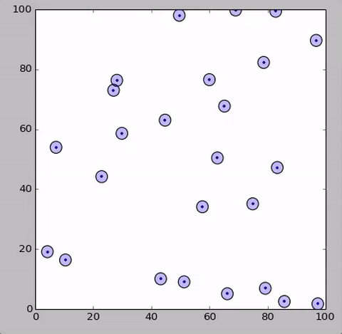
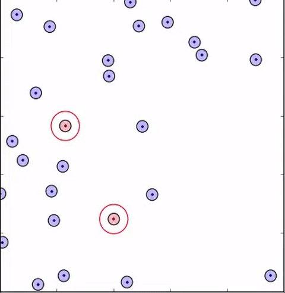
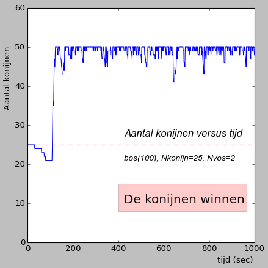

# Populatiedynamica: prooi-predator model#

Een van de meest klassieke voorbeelden van een complex dynamisch systeem is wel het zogenaamde prooi-predator 
model. De basis van de wiskundige beschrijving van de populaties zijn de bekende 
[Lotka-Volterra vergelijkingen](https://en.wikipedia.org/wiki/Lotka–Volterra_equations) vergelijkingen. 
De wiskunde wordt al snel erg complex en het is ook niet altijd makkelijk om van tevoren in te schatten 
welke effecten een nieuw aspect van het gedrag heeft op de verschillende populaties in het systeem. 

In deze module zullen we zelf een simulatie schrijven van een overzichtelijk systeem: een bos van 100 
bij 100 meter waarin 25 konijnen en 2 vossen leven. Door het zelf te programmeren kunnen we nieuwe dingen 
proberen en met de visualisatie krijgen we ook gelijk feedback en inzicht.

## Startpunt: twee konijnen op het scherm

We beginnen deze module, een beetje tegen de filosofie van de cursus in, niet met een leeg scherm, maar met 
het volgende stukje code. Niet omdat het erg moeilijk is, maar omdat we dan een gemeenschappelijk startpunt 
hebben en we op dezelfde manier stukken code toevoegen.

Het stukje code hieronder bestaat uit 3 functies. De hoofdfunctie, die wordt aangeroepen vanuit het hoofdprogramma 
helemaal onderaan, is `ProoiPredator()`. Deze functie definieert de startpositie van twee konijnen en neemt 
stapjes in de tijd (steeds een seconde) en roept voor elk tijdstip dan twee functies aan: `VerplaatsKonijnen()` 
die de positie van de konijnen verandert en `Teken_het_bos()` dat de konijnen op het scherm tekent.

    #-------------------
    def ProoiPredator():
    #-------------------

       #--/ startpositie 2 konijnen (x-posities en y-posities op t=0)
       L_konijn_x = [10.,60.]  
       L_konijn_y = [ 2.,10.]  
   
       #--/ neem stapjes in de tijd
       for i_time in range(10):

           #--/ verplaats de konijnen
           VerplaatsKonijnen(L_konijn_x,L_konijn_y)    

           #--/ plot de positie van de konijnen
           Teken_het_bos(L_konijn_x,L_konijn_y)
            
       #--/ einde functie                                                                                                                                                                                                                                                                                                                                                                                                                                                                                                                                  
       return

    #--------------------------------------------
    def VerplaatsKonijnen(L_konijn_x,L_konijn_y):
    #--------------------------------------------

         #--/ doe elke tijdstap een stapje voor de konijnen (2 naar rechts en 3 naar boven)
         Aantal_konijnen = len(L_konijn_x)   
         for i_konijn in range(Aantal_konijnen):
             L_konijn_x[i_konijn] = L_konijn_x[i_konijn] + 1.2 
             L_konijn_y[i_konijn] = L_konijn_y[i_konijn] + 1.6 
  
         #--/ einde functie
         return

    #--------------------------
    def Teken_het_bos(L_x,L_y):
    #--------------------------

         #--/ GRAFIEK (1): definieer een vast assenstelsel (het bos)
         fig=plt.figure()
         ax=fig.add_subplot()
         plt.axis([0,100,0,100])

         #--/ plot de positie van de konijnen (blauwe stip)
         plt.plot(L_x, L_y, 'o', color = 'blue')   

         #--/ PR (het oog wil ook wat): cirkels rond de posities van de konijnen
         Aantal_konijnen = len(L_x)   
         for i_konijn in range(Aantal_konijnen):
             x = L_x[i_konijn]
             y = L_y[i_konijn]
             circ1=plt.Circle((x,y), radius=2, facecolor='blue', edgecolor ='None', alpha = 0.1)  
             circ2=plt.Circle((x,y), radius=2, facecolor='None', edgecolor ='black', alpha = 1.0)
             ax.add_patch(circ1)
        
         #--/ GRAFIEK (2): update frames voor simpele animatie
         plt.draw()        #--/ Update de grafiek
         plt.pause(0.001)
         plt.clf()         #--/ Maak grafiek leeg bij elke tijdstap
         plt.show()
 
         #--/ einde functie
         return

    #==================
    #== MAIN PROGRAM ==
    #==================
    ProoiPredator()

### Opgave 1: modelleren van de beweging van de konijnen 

We hebben in bovenstaand voorbeeld aangenomen dat de konijnen bij elke stap in de tijd (elke seconde) 
steeds 1,2 meter naar rechts opschuiven en 1,6 meter omhoog. Dit is nog erg ver weg van een realistisch 
systeem natuurlijk: konijnen bewegen niet synchroon, ze rennen ook niet in een rechte lijn en als we de 
tijd langer door zouden laten doorlopen zullen de konijnen vrolijk het bos uitlopen. Dat is niet de 
bedoeling in deze opgave. Als de konijnen bij de rand van het bos komen zullen ze weer snel terug het 
(veilige) bos inlopen. In opgave 1 zullen we deze eerste stappen op weg naar realistische konijnen 
doorvoeren in onze code.

#### Deelopdracht (1a): nieuwe parametrisatie beweging konijnen

We hadden de verplaatsing van de twee konijnen ook kunnen representeren door te stellen dat ze moet 
dezelfde snelheid bewegen (2 meter per seconde) allemaal onder dezelfde hoek ten opzichte van de x-as: 
ongeveer 51 graden. Voeg in het hoofdprogramma een variabele `v_konijn` toe die de snelheid van 
de konijnen aangeef (2 m/s) en voeg een lijst `L_konijn_hoek` toe waarbij je voor elk konijn bijhoudt 
onder welke hoek ten opzichte van de x-as hij beweegt. In de functie waarin de nieuwe positie van de 
konijnen uitgerekend wordt is deze informatie nodig. In de hoofdcode `PooiPredator()` moet die functie 
als volgt aangeroepen worden:

       VerplaatsKonijnen(L_konijn_x,L_konijn_y, L_konijn_hoek, v_konijn)    

Op de plek in de functie `VerplaatsKonijnen()` waar de nieuwe posities van de konijnen uitgerekend wordt 
moet je de snelheid en de hoek waaronder de konijnen bewegen eerst omrekenen naar een  snelheid in de 
x- en y-richting. Gebruik hiervoor, voor konijn $$i$$:

       hoek = L_konijn_hoek[i]
       v_x = v_konijn * cos(hoek)
       v_y = v_konijn * sin(hoek)
    
En omdat de tijdstappen precies 1 seconde zijn kunnen we dan als volgt de nieuwe posities van het 
konijn uitrekenen:

       L_x[i_konijn] = L_x[i_konijn] + v_x
       L_y[i_konijn] = L_y[i_konijn] + v_y

We hebben nu de mogelijkheid om bij de start van de simulatie elk konijn een unieke bewegingsrichting te geven.

#### Deelopdracht (1b): de bosrand 

Onze konijnen, angsthazen dat het zijn, zullen nooit het bos verlaten. Zodra ze per ongeluk een stap buiten het bos doen draaien ze zich pijlsnel om en zullen daarna weer snel het bos inrennen in dezelfde richting al waar ze vandaan kwamen. Pas de functie `VerplaatsKonijnen()` zodanig aan dat de konijnen in het bos blijven rondlopen.

Volg de volgende strategie ls het konijn na een stap gezet te hebben buiten het bos is geraakt:

   1. neem een stap terug (in zowel x als y) zodat het konijn weer in de oorspronkelijke positie zit
   2. zorg dat het konijn zich omdraait. Zorg dus dat de hoek waarin het konijn beweegt precies tegenovergesteld 
      is aan zijn oorspronkelijke richting: hoek_nieuw = hoek + $$\pi$$. Stop deze nieuwe bewegingsrichting 
      (hoek_nieuw) op in de lijst `L_konijn_hoek`. Bij de volgende stap in de tijd rent hij dus weer het bos in. 
   
Probeer dit te testen door een van de konijnen direct naar de bosrand te laten bewegen en te kijken of hij inderdaad weer het bos in 'stuitert' zodra hij over de rand van het bos heengaat.

#### Deelopdracht (1c): random konijnen-gedrag

Iedereen die konijnen heeft ziet lopen weet dat niet in een rechte lijn bewegen, maar af en toe ineens stilzitten om dan ineens van richting te veranderen. Deze eigenschap moeten we ook implementeren in de simulatie.

Pas de functie `VerplaatsKonijnen()` zo aan dat het konijn gemiddeld eens in de 20 seconden van een seconde stilzit en daarna in een random richting verder wandelt. Een oplossing die je hiervoor zou kunnen gebruiken is om een random getal $$x$$ te trekken (tussen 0 en 1) en kijken of die waarde kleiner of groter is dan 1/20.

{:.inline}{: style="width:30%"}

      $$x<0.05$$: zet een stap als konijn

      $$x>0.05$$: geen stap, kien wel nieuwe hoek (0$$<$$hoek$$<2\pi$$).

#### Deelopdracht (1d): startsituatie: N konijnen op random posities

Een wereld met twee konijnen is natuurlijk niet realistisch. Pas het begin van `ProoiPredator()` zo aan dat er 25 konijnen in de simulatie zijn. Maak de code zo dat de konijnen elk op een random positie geplaatst worden, maar wel in een vierkantje dat gegeven wordt door $$20<(x,y)<30$$. Geef elke van de konijnen ook een random startrichting: $$0<\alpha<2\pi$$.

  

### Opgave 2: Harde realiteit voor de konijnen: vossen

Je kan natuurlijk de hele middag kijken naar 25 konijnen die over je scherm door een fictief bos rennen, maar daar is verder niks spannends of ingewikkelds aan. Laten we wat spektakel toevoegen.
 

#### Deelopdracht (2a): introduceren van vossen

Naast konijnen zijn er ook vossen in het bos. Pas de code zo aan de er ook (twee) vossen in de simulatie meedoen en op het scherm verschijnen. In grote lijnen kan je dezelfde structuur volgen die we ook voor de konijnen gebruikt hebben. Maar eerst lijsten die de positie en bewegingsrichtingen van de vossen beschrijven en maak ook een nieuwe functie `VerplaatsWolven()`. Net als de konijnen zal ook de vos nooit het bos verlaten. Zorg dat je voor de vossen eenzelfde implementatie maakt als voor de konijnen in opgave 1b). Als laatste moet je ook de functie `Teken_het_bos()` aanpassen zodat ook de vossen op het scherm getoond worden. 

Er zijn een paar verschillen tussen de vossen en de konijnen:

   - vossen zijn twee keer zo snel als konijnen (`v_vos = 4`) en staan nooit stil
   - teken de vossen in rood (zelfde grootte als de konijnen, radius = 2)
   - teken om de vossen ook een rode cirkel met straat r=5. 
     Deze cirkel zal later in de opgave fungeren als "the circle-of-death" voor de konijnen

Laat de vossen starten op posities (70,70) en (80,80) en laat bij de start vos 1 recht links en vos 2 naar beneden bewegen. Net als de konijnen hebben ook vossen een eigen unieke manier van voortbewegen.
 

#### Deelopdracht (2b): specifiek wandelgedrag van wolven

{:.inline}{: style="width:30%"}

De vos heeft de neiging om rechtdoor te lopen, maar kan er na elke stap voor kiezen om bij de volgende stap iets naar links en naar rechts te gaan. De kans op een bepaalde verandering ten opzichte van de oorspronkelijke bewegingsrichting neemt sterk af met een groter wordende afwijking. De verdeling van de kansen volgt een zogenaamde normaal-verdeling. De vos volgt hiermee een soort pseudo-random walk waarbij er toch een voorkeur is om in de oorspronkelijke richting te blijven lopen. Implementeer dit gedrag in je simulatie.

Python input: Om een 'random' nieuwe richting te kiezen vanuit een normaalverdeling die gecentreerd is rond de oorspronkelijke bewegingsrichting kan je de volgende syntax gebruiken:
   
     new_angle = numpy.random.normal(L_vos_hoek[i_vos], 0.2)  

Laat de vos eerst een stap zetten en kies dan een nieuwe random richting en sla die op in `L_vos_hoek`. Bij de volgende stap zal de vos dan in deze nieuwe richting gaan bewegen. De waarde 0.2 is de bovenstaande uitdrukking is de zogenaamde breedte van de normaal-verdeling. Het bepaalt hoe makkelijk (of niet) de vos van zijn oorspronkelijke bewegingsrichting af kan wijken.

  

### Opgave 3: populatie-dynamica (de dood - vossen eten konijnen)

In de natuur leven vossen en konijnen niet vredig naast elkaar. Als een vos een konijn tegenkomt zal 
hij de konijn opeten. 

#### Deelopdracht (3a): verdwijnende konijnen

Schrijf een nieuwe functie `Etenstijd()` die in de hoofdfunctie `ProoiPredator()` 
wordt aangeroepen voor elke stap in de tijd nadat de konijnen en de vossen een stap hebben gemaakt. Deze 
functie heeft als taak te evalueren voor elk konijn of hij zich in de buurt bevindt van een vos. Met 
'in de buurt' wordt trouwens bedoeld: 'within the circle of death', dus op een afstand van 5 of minder 
van de dichtstbijzijnde vos. Als dat zo is sterft het konijn en moet hij verwijderd worden uit de lijst 
met konijnen.

Om een element $$i$$ uit een lijst $$L$$ weg te halen gebruik je de volgende syntax:

     del L[i] 

**Let op:** 
Als je door een lijst van 20 elementen heenloopt en element 10 weghaalt dan schuiven alle elementen 1 positie op. Element 11 van de oorspronkelijke lijst wordt dan element 10 in de nieuwe lijst etc. De lijst is dan ook ineens 19 posities lang geworden. Een slimme 'truc' om dit op te vangen is om de lijst in omgekeerd volgorde af te lopen. Begin dus bij konijn 20, vervolgens naar konijn 19 etc etc. De lijst wordt dan wel korter, maar je komt nooit in de problemen omdat je nooit element weghaalt die je later nog wilt bekijken.

{:.inline}{: style="width:30%"}

Om in omgekeerde volgorde door een lijst van 20 konijnen heen te gaan kan je de volgende syntax gebruiken:

    for i_konijn in range(19,-1,-1):
         print i_konijn         

Extra tip: als een konijn opgegeten wordt haal dan het element weg uit **alle** lijsten, dus de x-positie de y-positie en de bewegingsrichting.

Zet ook de puntjes op de i door op elk moment op het scherm te zetten bij welk tijdstap we zitten en hoeveel vossen en konijnen er zich nog in het bos bevinden.
  
          
#### Deelopdracht (3b): Gemiddelde halfwaardetijd konijnenpopulatie

Het laten zien van bewegende en verdwijnende konijnen op het scherm is enorm tijdrovend. Als je met de opzet zoals hierboven 100 tijdstapjes wilt doen kan je daar nog op wachten, maar tienduizend stapjes is al niet meer te doen. Door de visualisatie weg te laten kan je enorm veel tijd winnen en het stelt je in staat wat langere scenario's door te rekenen. En toch is het visualiseren van een simulatie enorm belangrijk en meer dan 'gewoon leuk om te zien'. Visualiseren van een bepaald patroon is erg krachtig zoals je waarschijnlijk in de bovenstaande opgave al ervaren hebt toen je de implementatie van de bosrand of het opeten van de konijnen aan het implementeren was.

Zorg dat je in de hoofdfunctie `ProoiPredator()` een variabele aanbrengt waarmee je makkelijk kan kiezen of je wel/niet de functie `Teken_het_bos()` aanroept. Vanaf nu gaan we de visualisatie niet meer aanroepen. Tenzij je iets wilt bekijken natuurlijk.

Verander de functie `ProoiPredator()` zodanig dat je aan het eind van de functie weet bij welke tijdstap er voor het eerst minder dan 50% van het oorspronkelijk aantal konijnen nog levend in het bos rondloopt. In navolging van radioactief verval noemen we dit de halfwaardetijd van de konijnen. Hieronder vind je een paar grafieken van het aantal konijnen als functie van de tijd. probeer deze grafieken na te maken om te kijken of je inderdaad de goede gegevens uit je simulatie haalt.

 {: style="width:65%"}

Ons programma is nu opgezet om een enkele simulatie te runnen door de functie `ProoiPredator()` aan te roepen, maar zoals je ziet is er een vrij grote spreiding in de precieze halfwaarde tijd. Om de gemiddelde halfwaardetijd te bepalen zullen we de een groot aantal simulaties moeten uitvoeren, voor elk de halfwaardetijd bepalen om dan uiteindelijk uit al die getallen het gemiddelde te bepalen.

Schrijf een nieuwe functie `GemiddeldeHalfwaardetijd()` die een groot aantal keer (500) de functie `ProoiPredator()` aanroept en steeds de halfwaarde tijd opslaat in een lijst om uiteindelijk het gemiddelde te berekenen en op het scherm te print. Zorg dat de functie `ProoiPredator()` als return-waarde de halfwaardetijd teruggeeft.

Op het scherm moet dan uiteindelijk verschijnen:

    Een gesimuleerde wereld met: Nkonijn=25 (v=2), Nwolf=2 (v=4), Nsimulaties = 100:
    Gemiddelde halfwaardetijd = x.xx seconde

#### Deelopdracht (3c): Strategie konijnen: snelheid aanpassen

We hebben in de vorige opdracht gekeken wat de gemiddelde halfwaardetijd is van de konijnenpopulatie voor een specifieke snelheid van de konijnen. De konijnen willen natuurlijk niet dood, dus moeten iets bedenken. Discussiepunt onde de konijnen is of ze nu juist beter heel hard kunnen gaan lopen of juist stil moeten gaan zitten en hopen dat de wolven ze niet vinden. Ze kunnen maar 1 keer kiezen en vragen dus aan jou om de optimale strategie te bepalen.

Run de functie `GemiddeldeHalfwaardetijd()` met een aantal waardes van de snelheid voor de konijnen en maak een grafiek van de gemiddelde halfwaardetijd als functie van de snelheid. Je mag in deze opdracht de snelheid van de konijnen `v_konijn` in de  functie `ProoiPredator()` steeds met de hand veranderen. Probeer verschillende snelheden voor de konijnen: snelheden van 0 tot en met 5 in stapjes van 0.5 en maak een grafiek van de gemiddelde halfwaardetijd als functie van de snelheid. Wat zie je?

 

### Opgave 4: Reproducerende konijnen en overbevolking

We hebben in de vorige opgave bestudeerd hoe (snel) het aantal konijnen afneemt als er twee vossen in het bos rondlopen. 
Het aantal konijnen kan echter ook toenemen natuurlijk omdat konijnen zich kunnen voortplanten. We gaan kijken wat het 
effect is van reproductie als we dat als element meenemen in onze populatie-simulaties. Tegelijk met een mogelijke 
toename van het aantal konijnen is het ook belangrijk om mee te nemen dat ons bos maar voedsel biedt voor een beperkt 
aantal konijnen. beide aspecten gaan we meenemen in onze simulatie.

Voeg in de hoofdfunctie `ProoiPredator()` twee nieuwe functies toe: `BeschuitMetMuisjes()` en `Overbevolking()` toe die 
deze fenomenen gaat implementeren.

**Stap 1:** reproducerende muizen

Zorgt dat de functie `BeschuitMetMuisjes()` op elke stap in de tijd kijkt of er konijnen dicht bij elkaar zitten 
en vervolgens nieuwe konijnen in het bos neerzet.

Ga hierbij als volgt te werk:

  1. Roep de functie pas aan na 100 seconden. Roep pas na die tijd de extra functie aan. De konijnen 
     beginnen al erg dicht bij elkaar namelijk en zijn in het begin nog te jong om zicht te reproduceren.

  2. Bepaal nadat de konijnen een stap hebben gezet en nadat de vossen konijnen hebben mogen opeten  
     eerst hoeveel (paren) konijnen er zijn die dicht bij elkaar zitten (afstand < 1). Dit bepaalt het 
     aantal nestjes. Let op: vermijd hierbij dubbeltellen. 

  3. Genereer vervolgens voor elk nestje 4 nieuwe konijnen, geef ze een random positie in het bos en random 
     bewegingsrichting en voeg ze toe aan de lijst van konijnen.
  
**Stap 2:** maximum aantal konijnen in het bos

De functie `Overbevolking()` heeft als doel te zorgen dat er op moment in de tijd nooit meer dan 50 konijnen in 
het bos aanwezig zijn. Kijk dus hoe lang de lijst met konijnen is aan het eind van elke stap en verwijder elk 
element in de lijst van konijnen boven de 50.

#### De opdracht: winstkansen konijnen

Het systeem is vrij instabiel en je zal zien dat na 1000 seconden of de konijnen winnen (konijnen zitten tegen het maxmimum van 50 aan) of de vossen winnen (er zijn geen konijnen meer). De onderstaande grafieken, gemaakt met bijna dezelfde routine die we in opdracht 3b gebruikt hebben, laten het aantal konijnen zien als functie van de tijd voor twee simulaties die elk een extremum gevonden hebben.

 {: style="width:40%"}
 {: style="width:40%"}

De opdracht luidt als volgt: wat is de winstkans van de konijnen ? Concreter: in welk percentage van de simulaties zijn er na 1000 seconden meer dan 45 konijnen in het bod ? 

Maak een routine die 200 simulaties draait, hou in hoeveel gevallen de konijnen winnen en print uiteindelijk het antwoord als volgt op het scherm:

     Een gesimuleerde wereld met: Nkonijn=25 (v=2), Nwolf=2 (v=4), Nsimulaties = 200:     
     In x.x procent van de gevallen winnen de konijnen

