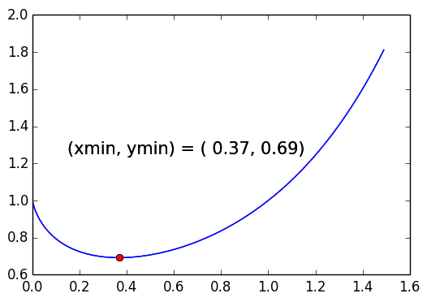

# Plot

Schrijf een programma dat de volgende grafiek laat zien.

## Specificatie

* Maak een file `plot.py` en schrijf daarin een programma dat de grafiek van de functie $$f(x) = x^x$$ tussen $$x=0$$ en $$x=1.5$$ in stapjes van $$0.01$$ plot. Gebruik hiervoor een blauwe lijn.

* Het minimum van de functie moet je uitrekenen. Omdat je een lijst hebt met x-waarden en een lijst met y-waarden kun je dit redelijk makkelijk doen via een `for`-loop.

* Zorg dat het minimum in de grafiek wordt aangegeven door middel van een rode stip en een tekstje.

* Gebruik `print` om het minimum ook nog als tekst naar de terminal te printen.

## Hints

* Vul eerst twee lijsten met de juiste x- en y-waarden en doe daarna de plot.

* Kijk goed naar [de voorbeelden](/technieken/plot).

* Bij het gebruiken van libraries/bibliotheken is het heel nuttig om Google te gebruiken. Wil je weten hoe je iets voor elkaar speelt met pyplot? Google maar! Tip: gebruik het woord "example" om naar voorbeelden te zoeken.

* Om `matplotlib` te gebruiken moet je deze importeren bovenaan je programma:

		import matplotlib.pyplot as plt

* Om `matplotlib` te gebruiken in de online IDE, heb je nog iets meer nodig:

		import matplotlib
		matplotlib.use('Agg')
		import matplotlib.pyplot as plt

* Vergeet trouwens niet dat `^` in Python zelf géén machtsverheffen is. Je moet voor het berekenen van een macht de operator `**` gebruiken.

* Krijg je het plotten niet werkend? Stuur ons een mail!

## Testen

Testen is voor deze opdracht wat lastiger, want checkpy kan niet beoordelen of je grafiek er goed uitziet. Of die correct is moet je dus zelf nagaan door goed met het voorbeeld te vergelijken. Checkpy kan wel testen of je überhaupt een grafiek maakt.

    checkpy plot
