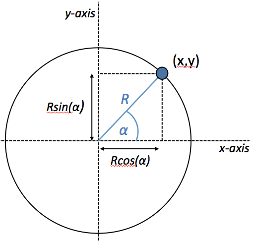

## Animatie van spiraliserende stip

Een balletje draait met een bepaalde hoeksnelheid rond en met elke stap in de
tijd verandert niet alleen de hoek, maar wordt ook de straal steeds kleiner tot
hij uiteindelijk precies in het midden stilstaat:

Op elk moment wordt een punt beschreven door 2 coordinaten $$(x,y)$$, maar je
kan ook 2 andere variabelen gebruiken ($$\alpha$$,R), waarbij $$\alpha$$ de
hoek is met de positieve $$x$$-as en R de afstand tot de oorsprong. De
variabelen kunnen in elkaar omgeschreven worden zoals in de grafiek is
aangegeven.

Schrijf een programma **spiraal.py** waarin de stip geanimeerd wordt zoals hierboven beschreven. Details voor de animatie:

- hoek $$\alpha$$ varieert van $$0$$ tot $$20$$ radialen in stappen van $$0.1$$
- straal $$R$$ hangt af van $$\alpha$$, namelijk $$R=10-0.5\alpha$$
