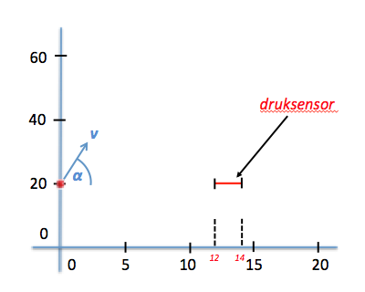

# Angry Birds

We bekijken een situatie zoals in het plaatje hieronder getekend waarbij een vogel wordt weggeschoten vanaf de positie ($$x=0$$, $$y=20$$) met snelheid $$v$$ onder een hoek ($$\alpha$$). In het programma **angry_birds.py** gaan we bestuderen welk pad de vogel zal afleggen. Net as in de vorige opgaves gebeurt dat onder invloed van de zwaartekracht.

## Opdracht: beweging van de vogel

Schrijf een *functie* genaamd `beweging()` die de beweging van de bal beschrijft. Als de vogel de grond raakt zal deze weer omhoog stuiteren zonder daarbij energie te verliezen.

De parameters van de functie zijn:

- snelheid
- hoek (in graden)

## Opdracht: druksensor

We voegen een extra element toe in het probleem; een druksensor die reageert als er een bal tegenaan botst. Dit kan zowel vanaf de bovenkant als de onderkant zijn. De druksensor bevindt zich op een hoogte $$y_{sensor}=20$$ en strekt zich uit van $$12 < x_{sensor} < 14$$ zoals getekend in onderstaande schets.

Schrijf een functie `angry_birds()` in het zelfde bestand **angry_birds.py** die bestudeert welke hoeken er voor zorgen dat de weggeschoten bal de druksensor zal raken als de bal met een snelheid van $$v=16$$ [m/s] wordt weggeschoten. Varieer de hoek $$\alpha$$ in stappen van 1 graad ($$-88 < \alpha < +88$$).

Om dit te bereiken pas je eerst de functie `beweging()` aan. Voortaan moet de functie een waarde `return`en die aangeeft of bij deze hoek de sensor wordt geraakt.

	beweging(16, 79) --> geeft False

In je hoofdfunctie `angry_birds()` maak je dus herhaaldelijk gebruik van de functie `beweging()`, waarin het echte rekenwerk wordt gedaan. De hoofdfunctie verzamelt de resultaten en print.

### Uitvoer

1. Maak een grafiek waarin duidelijk wordt welke hoeken wel/niet voor een contact met de druksensor zorgen.

2. Print een regel voor elke hoek waarbij wél contact met de sensor volgt, zoals:

		-2 graden
		-1 graden
		0 graden
		2 graden

### Tips

- Bepaal of je kunt herkennen als de vogel de lijn $$y=20$$ kruist en test of *als* dat gebeurt het is in het gebied van de druksensor: $$12<x<14$$. 

### Extra (optioneel):

De standaardmanier om de positie van de vogel te tekenen die we in deze cursus  geleerd hebben is de volgende:

    plt.plot(x_kogel, y_kogel, 'bo')  

Het is natuurlijk veel leuker om in plaats van een stipje een plaatje van een  vogel te laten rondvliegen. Je hebt daar de volgende constructie voor nodig. Het stuk `plt.imshow` tekent het plaatje op het scherm. Je moet hierbij duidelijk het gebied aangeven waar het plaatje afgebeeld wordt. Hier is gekozen als positie die van de kogel en een afmeting van $$0.5$$ in $$x$$ en $$2.0$$ in $$y$$ respectievelijk.

    import matplotlib.image as image

    im = image.imread('AngryBirdsLogo.png')
    plt.imshow(im, aspect='auto', extent=(x_kogel, x_kogel+0.5, y_kogel, y_kogel+2), zorder=-1)
