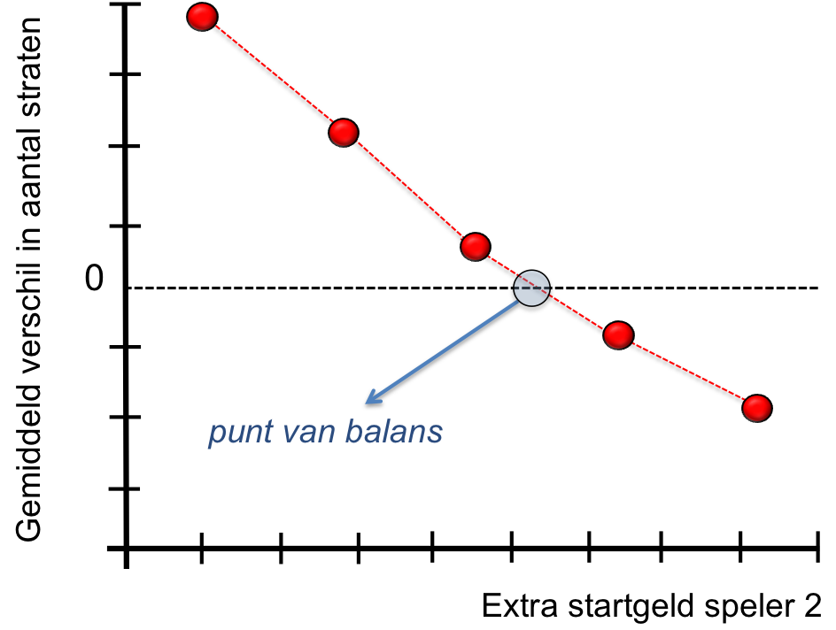

## Opdracht 3: Realisme toevoegen: twee spelers

In het echt wordt het spel Monopoly gespeeld door twee spelers. Doel van deze opdracht is om eerst 
te evalueren wat het voordeel is van de speler die begint met gooien en vervolgens te bestuderen hoe
we in het spel dit nadeel voor speler 2 kunnen herstellen.
 
{:.inline}{: style="width:35%"}
 
Let op: we gaan nu de code uit opdracht 2 aanpassen. Om te zorgen dat die werkende code bewaard blijft 
gaan we deze opdracht maken in een nieuw bestand. Maak een nieuw Python bestand aan, `Monopoly_opdracht3.py`, 
kopieer de code die je tot nu toe hebt en ga verder in deze nieuwe file.

#### [deelopdracht 3a] voordeel van speler 1

Voeg eerst een tweede speler toe in je simulaties, laat beide spelers beginnen met 1500 euro startgeld 
en bepaal het verschil in aantal straten tussen speler 1 en speler 2 op het moment dat alle 
straten verkocht zijn. Dit verschil zal elk potje verschillen. Simuleer daarom 10000 potjes om een goede 
schatting te krijgen van het gemiddelde verschil. Je zal zien dat speler 1 inderdaad een klein voordeel 
heeft op speler 2.

Print het verschil naar het scherm:
{: .language-python}
	Monopoly simulator: 2 spelers, 1500 euro startgeld, 10000 potjes
    Gemiddeld heeft speler 1 X.XX meer straten in bezit als alle straten verdeeld zijn

#### [deelopdracht 3b] nadeel van speler 2 repareren

De vraag is nu of en zo ja hoe we deze 'oneerlijke' situatie kunnen repareren. Een van de 'knoppen' 
waar je aan kan draaien in dit spel is de hoeveelheid startgeld die de spelers krijgen. Als speler 
2 meer startgeld krijgt kan hij iets van zijn achterstand repareren. Bepaal de hoeveelheid extra 
startgeld die we aan speler 2 moeten geven aan het begin van het spel zodat hij gemiddeld net zoveel 
straten in zijn bezit heeft als speler 1 op het moment dat alle straten verdeeld zijn. Geef speler 2 
steeds wat meer geld (kies een paar waardes van het startgeld en voer dat steeds handmatig in) en 
bereken steeds het verschil. Als je een paar simulaties hebt gedraaid heb je een kleine data-set waarmee 
je bovenstaande grafiek kan reproduceren en een goede schatting kan maken van de hoeveelheid extra geld 
dat we speler 2 moeten geven aan het begin van het spel om het evenwicht te herstellen. 

Reproduceer de grafiek en geef zowel in de grafiek als geprint naar het scherm aan hoeveel extra geld 
speler 2 moet krijgen om het evenwicht te herstellen. Het antwoord moet op 50 euro nauwkeurig zijn.

{: .language-python}
	Monopoly simulator: 2 spelers
    Als we speler 2 XXX euro meer startgeld meegeven hebben beide spelers gemiddeld evenveel straten in bezit

## Samenvatting

De simulatie die we hier gedaan hebben is een versimpelde versie van de vaak zeer complexe 
modellen waarmee grote financiele partijen risico's inschatten en strategieen bepalen. 
Tegelijkertijd worden deze simulaties ook gebruikt door politieke partijen om de effecten 
van hun keuzes door te rekenen in verschillende scenario's.

