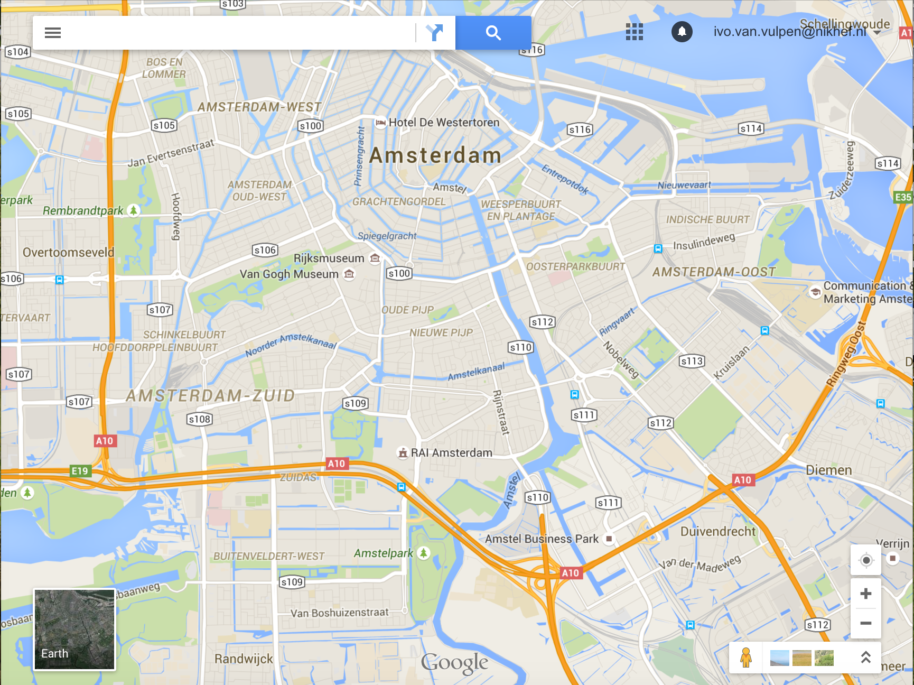

# Opdracht: Sensordata 
    
Een mobiele telefoon bevat veel delicate sensoren die informatie verzamelen over de positie, snelheid, versnelling. We hebben gedurende een korte auto-rit de data opgeslagen en in een file weggeschreven met een frequentie van 1[Hz]. Het verzamelen van de data begon toen de auto zich bevond op de plek waar de snelweg A4 op de ringweg A10 aansluit. Het verzamelen van de data stopte toen de auto op het Nikhef was aangekomen.

De sensordata is beschikbaar in de file `AutoRitData.csv` en is te downloaden  via de volgende link:

<http://www.nikhef.nl/~ivov/Python/SensorData/AutoRitData.csv>

Bovenin de file staat kort welke informatie elk veld bevat. Dit is typisch hoe je een databestand binnen krijgt: in een formaat dat snel automatisch te lezen is, maar soms ontbreken duidelijke omschrijvingen van wat het nu precies allemaal is. Toch moet je wel aardig kunnen afleiden wat je er mee kunt. (Probeer dus ook eerst zelf wijs te worden uit het bestand voordat je met anderen in discussie gaat hierover. Goede oefening!)

Schrijf een programma **autorit.py** dat de file doorloopt, de data verwerkt en beantwoord de volgende vragen.

## Afgelegde afstand

Maak een grafiek van de snelheid van de auto (in km/uur) als functie van de tijd en gebruik de data om een schatting te maken van de totaal afgelegde weg.

## De afgelegde route

Maak een grafiek van de positie van de auto en kleur de route groen (rood) op de stukken van de route waar de snelheid van de auto meer (minder) was dan 50 km/uur.
