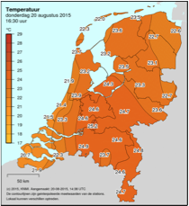

# Klimaatdiscussie

{:.inline}

Laten we een steentje bijdragen aan de klimaatdiscussie en data analyseren die  door de ECA (European Climate Assessment) [beschikbaar](http://eca.knmi.nl/dailydata/predefinedseries.php) wordt gemaakt in grote  data files. We beperken ons tot data die de maximum- en minimumtemperatuur beschrijft voor elke dag in De Bilt sinds 1901.

Bestanden: 

- <http://www.nikhef.nl/~ivov/Python/KlimaatData/DeBiltTempMax.txt>
- <http://www.nikhef.nl/~ivov/Python/KlimaatData/DeBiltTempMin.txt>

Download de bestanden, open ze en lees bovenin hoe de data gecodeerd is. We zien dat de maximum(minimum)-temperatuur op 1 januari 1901 -3.1(-6.8) graden Celsius was.

> Let op! De datafiles bevatten ook allerlei uitleg. De bedoeling is dat je deze laat staan in het bestand. Je Python-programma moet zo geschreven zijn dat je deze regels netjes overslaat bij het verwerken!

Schrijf een programma **temperatuur.py** die de file regel voor regel inleest
en beantwoord de volgende vragen.

### Opdracht 1: extreme temperaturen

Wat waren de hoogste en laagste temperatuur die in De Bilt zijn gemeten sinds het begin van de 20e eeuw? Op welke dagen was dat? Zorg dat je programma de datum netjes op het scherm print. Zeg dus niet: 

     Max 34.5 op 19670513

maar      

     De hoogste temperatuur was 34.5 graden Celcius, en werd gemeten op 13 mei 1967.

Tip: maak een aparte functie die een getal als `19670513` kan omzetten naar een goed leesbare beschrijving als `13 mei 1967`.

### Opdracht 2: koud kouder koudst

Wat is de langste periode dat het aaneengesloten heeft gevroren (maximumtemperatuur onder 0◦C). Wat was de datum van de laatste dag van deze periode?

### Opdracht 3: zomerse en tropische dagen

We spreken van een zomerse dag als de maximumtemperatuur meer dan 25 graden Celcius was. Op een tropische dag is het in de Bilt zelfs 30 graden. Maak een grafiek waarin voor elk jaar zowel het aantal zomerse als het aantal tropische dagen weergegeven wordt.

### Opdracht 4: Eerste hittegolf

We spreken in Nederland van een hittegolf als de maximumtemperatuur ten minste vijf dagen achtereen minstens 25,0°C was (zomerse dagen) waarvan ten minste op drie dagen 30,0°C of meer (tropische dagen). Print het *eerste* jaartal uit de dataset waarin er sprake was van een hittegolf volgens deze regels.

### Nette code en nette uitvoer

Zorg dat de code van alle opdrachten in een functie of in functies staat. Gebruik geen globale variabelen (vraag indien nodig wat dit is)!

Je ziet hierboven dat je een aantal dingen moet uitprinten en één grafiek maken. Zorg dat de gevraagde informatie op losse regels wordt uitgeprint, in de juiste volgorde.
