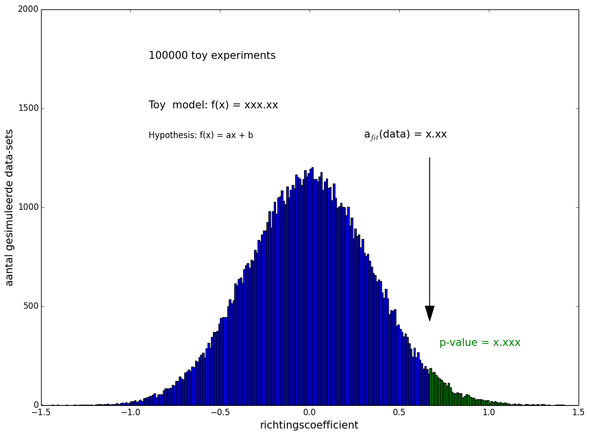

## Opdracht 5: Hypotheses testen

Een deel van de onderzoekers vindt dat de data suggereert dat er een lineair verband te 
zien is in de data terwijl een ander deel vindt dat er geen afhankelijkheid is en dat de 
geobserveerde lichte afhankelijkheid gewoon toeval is door de steekproeven die genomen zijn. 
We sluiten deze module af door wat quantitatieve data aan te leveren voor dee discussie.

De vraag is eigenlijk: "hoe zeldzaam is het dat, gegeven dat er in het echt <b>geen</b> verband bestaat, 
een serie steekproeven (van deze grootte in elke categorie) een waarde van de richtingscoefficient 
geeft die net zo groot is als in de data of zelfs nog groter?" Deze fractie kom je vaak tegen in de 
literatuur en wordt ook wel de  p-waarde genoemd.

#### opdracht 5: Simuleer random data-sets en bereken de p-waarde

Schrijf een programma `statistiek_opdracht5.py()` die bovenstaande vraag beantwoordt door te kijken 
hoe zeldzaam de geobserveerde richtingscoefficient in de data is als er eigenlijk helemaal geen 
afhankelijkheid is.

Volg om de vraag te beantwoorden de volgende strategie:

   1. Simuleer een data-set:

       * Ga uit van een 'vlakke' hypothese: f(x) = C, met C de waarde uit opdracht 3.

	   * Kies in elk van de 10 inkomenscategorie&euml;n een 'random' meetpunt door gebruik te maken 
	     van `numpy.random.normal(gemiddelde,breedte)`, waarbij het gemiddelde in elke inkomenscategorie 
		 gegeven wordt door de waarde die je in opdracht 3 vond. Gebruik als breedte in elke categorie 
		 de onzekerheid op de gemiddelde lengte in die in komenscategorie in de oorspronkelijke data-set. 
		 Dat is dus bijvoorbeeld 4 cm in inkomenscategorie 1.
		
	   * Ken als onzekerheid op de random gekozen gemiddelde lengte in elke inkomenscategorie dezelfde 
	     fout toe als in de oorspronkelijke data. Dat is dus bijvoorbeeld 2 cm in inkomenscategorie 5.
	   
   2. Fit een functie van de vorm f(x) = ax+b en bepaal de richtingscoefficient (a).

   3. Doe bovenstaande een groot aantal keer (10000 keer bijvoorbeeld) en onthoud voor elke 
      data-set de richtingscoefficient. Hou bij welke fractie van de gesimuleerde data-sets 
	  (toevallig) een richtingscoefficient opleverde die gelijk was aan (of nog groter was 
	  dan) die in de originele data-set (zie opdracht 4).  

   4. Maak een grafiek (histogram, zie hieronder) van alle richtingscoefficenten en geef duidelijk 
      aan wat de gevonden waarde is in de data en de bijbehorende p-waarde. 
	  
      {: style="width:60%"}

   5. Print de p-waarde aan het eind van het programma ook op het scherm: in procenten, met 2 decimalen.
    
      {: .language-python}
     	De p-waarde voor de alternatieve hypothese = x.xx procent

In de regel houden we vast aan de regel dat als de p-waarde kleiner is dan 5 procent we nog van 
'toeval' spreken. Is de p-waarde groter dan 5% dan zeggen we dat de geobserveerde trend niet goed 
te verklaren valt met een vlakke hypothese en dat we bewijs hebben gevonden voor een verband.

*Let op:* Een gevonden verband is nog geen causaal verband. Stel dat er een verband is gevonden 
(en hou altijd in het achterhoofd dat het geobserveerde effect alsnog toeval kan zijn), wat zou 
dan de onderliggende oorzaak kunnen zijn ? Rijkere mensen: eten gezonder, wonen in huizen die 
in een buurt liggen met betere luchtkwaliteit, of andersom dat in onze maatschappij de 
lengte juist zorgt voor een hogere inkomen ? Etc etc. Graven graven graven tot je doordringt tot 
de kern en iets nieuws ontdekt dat nog niemand voor jou gezien heeft. Dat is wetenschap!

