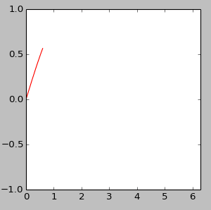
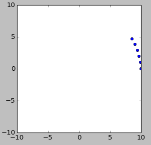
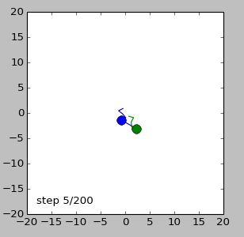

 Animaties

Hoewel een grafiek heel handig kan zijn om een simulatie te visualiseren is het
soms inzichtelijker een animatie te maken. Python biedt je de mogelijkheid om
een figuur steeds opnieuw te tekenen. Dat geeft je verschillende mogelijkheden
om een beweging aan te geven. We bouwen hier een kort voorbeeld, waarin we een
lijn (en punt) volgens $$f(x)=sin(x)$$ over het scherm laten bewegen. We bouwen
de functie op in 3 stappen waarbij we telkens 1 element toevoegen. Met behulp
van deze functionaliteit kun je een groot scala aan animaties maken.

## Een bewegend punt

Als je een punt tekent (één $$x$$-waarde en één $$y$$-waarde) waarvan je $$x$$
en $$y$$ steeds verandert dan lijkt het of het punt over het scherm beweegt. In
de code hieronder nemen we steeds stapjes in $$x$$, rekenen $$y$$ uit en
tekenen het punt op het scherm. We gebruiken ook de commando's `xlim` en `ylim`
om in de plot aan te geven welke $$x$$-waardes en $$y$$-waardes we willen zien.

    import math
    import numpy as np
    import matplotlib.pyplot as plt
    
    # neem kleine stappen in x tussen 0 en 2pi
    for x in np.arange(0,2 * math.pi, 0.05):

        y = math.sin(x)

        # plot grafiek
        plt.plot(x, y, 'bo', markersize = 10)  # blauwe punt
        plt.xlim(0,2 * math.pi)
        plt.ylim(-1, 1)
        plt.draw()           # update grafiek
        plt.pause(0.001)
        plt.clf()            # clear grafiek

> Je ziet dat we in de code de functie `pause()` aanroepen. Dat doen we om pyplot de gelegenheid te geven de nieuwe figuur op het scherm te tekenen. Dit wordt alleen gedaan tijdens de pauzes die we geven.

## Een bewegende lijn

Een grafiek tekenen we met behulp van lijsten: een lijst met $$x$$-waardes en
een lijst met $$y$$-waardes. Als je die lijsten steeds uitbreidt dan krijg je
het onderstaande effect: de functie $$f(x) = sin(x)$$ getekend met een rode
lijn.

    import math
    import numpy as np
    import matplotlib.pyplot as plt
    
    L_x = []
    L_y = []

    # take small steps in x
    for x in np.arange(0,2 * math.pi, 0.05):

        y = math.sin(x)

        L_x.append(x)
        L_y.append(y)

        # plot grafiek
        plt.plot(L_x, L_y, 'r-')   # rode lijn
        plt.xlim(0,2 * math.pi)
        plt.ylim(-1, s1)
        plt.draw()           # update grafiek
        plt.pause(0.001)
        plt.clf()            # clear grafiek

Zoals je ziet is de code maar drie regels veranderd ten opzichte van voorbeeld
1. Het resultaat ziet er als volgt uit:

## Een stip, een lijn en tekst op het scherm

Je kan de stip en de lijn ook tegelijk tekenen en op het scherm ook informatie
weergeven over de $$(x,y)$$ positie van het punt op het scherm.

    import math
    import numpy as np
    import matplotlib.pyplot as plt
    
    L_x = []
    L_y = []

    # take small steps in x
    for x in np.arange(0,2*math.pi,0.05):

        y = math.sin(x)

        L_x.append(x)
        L_y.append(y)

        # plot grafiek
        plt.plot(L_x, L_y, 'r-')               # rode lijn
        plt.plot(x, y, 'bo', markersize = 10)  # blauwe stip
        plt.xlim(0,2 * math.pi)
        plt.ylim(-1,1)

        # text op scherm      
        plt.text( 0.25, -0.8, "(%.2f,%.2f)" % (x,y) )  

        plt.draw()           # update grafiek
        plt.pause(0.001)
        plt.clf()            # clear grafiek

## Opgave 1: animatie van spiraliserende stip

Een balletje draait met een bepaalde hoeksnelheid rond en met elke stap in de
tijd verandert niet alleen de hoek, maar wordt ook de straal steeds kleiner tot
hij uiteindelijk precies in het midden stilstaat:

Op elk moment wordt een punt beschreven door 2 coordinaten $$(x,y)$$, maar je
kan ook 2 andere variabelen gebruiken ($$\alpha$$,R), waarbij $$\alpha$$ de
hoek is met de positieve $$x$$-as en R de afstand tot de oorsprong. De
variabelen kunnen in elkaar omgeschreven worden zoals in de grafiek is
aangegeven.

Schrijf een programma **spiraal.py** waarin de stip geanimeerd wordt zoals hierboven beschreven. Details voor de animatie:

   - $$\alpha$$ varieert van $$0$$ tot $$20$$ in stappen van $$0.1$$
   - $$R$$ hangt af van $$\alpha$$, nl: $$R=10-0.5\alpha$$

## Opgave 2: de dronken student

Een dronken student (die natuurlijk geen natuurkunde studeert, want die liggen altijd
keurig vroeg in bed) neemt elke seconde een stap. De grootte van de stap is
steeds hetzelfde ($$R = 1$$), maar de richting waarin hij die stap neemt is
volledig willekeurig. Kies bij elke stap in de tijd een random hoek $$\alpha$$
en bepaalt vervolgens de nieuwe $$x$$-positie en $$y$$-positie. Hieronder zie
je de student als blauwe stip en het ook het pad dat hij gevolgd heeft. Dit
staat bekend als een *random walk*.

Als twee studenten dronken zijn en ze elkaar uit het oog verliezen wordt het
erg onwaarschijnlijk dat ze elkaar nog terugvinden. Probeer de volgende
animatie na te maken waarin je de beide studenten ziet lopen. Geef op het
scherm ook aan hoe lang de gebruiker van je programma nog moet wachten tot het
programma afgelopen is.

Schrijf een programma **student.py** waarin de stip geanimeerd wordt zoals hierboven beschreven.

Probeer ook eens of je (met en en papier) iets kan zeggen over de gemiddelde
afstand die de studenten van elkaar verwijderd zijn als functie van het aantal
stappen dat ze nemen.

Filmpje opslaan? Probeer een tool als [GifGrabber](http://www.gifgrabber.com)
te gebruiken om een animated gif te maken. Die kan je in een webbrowser
bekijken.

## Sanity check

Je kunt deze opgaven allemaal maken met de Python-onderdelen die je kent uit modules 1 en 2!
