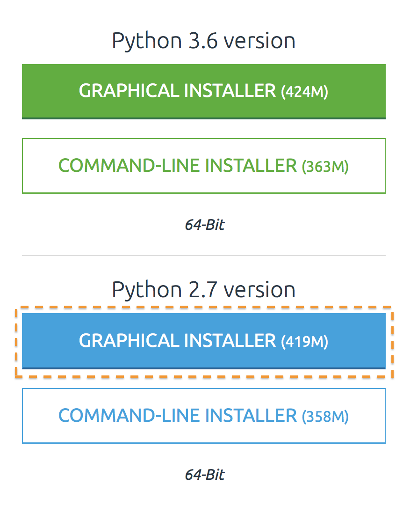

# Python op je eigen computer

## Om te beginnen

Om te kunnen programmeren op je eigen computer heb je twee verschillende programma's nodig: de taal zelf, en een goede editor:

1. **Anaconda**, een versie van Python die makkelijk te installeren is. Er zitten ook een boel *packages* bij, waarin extra functionaliteit zit voor grafieken, statistiek en nog allerlei andere dingen.

2. **Visual Studio Code**, een *editor* om code in te schrijven. Dit is in feite een soort tekstverwerker, maar dan speciaal bedoeld voor programmacode. Deze geeft bijvoorbeeld verschillende woorden verschillende kleurtjes, zodat je een goed overzicht houdt van je programmacode.

Zit je vast? Stuur gerust een [mailtje](mailto:inleiding@mprog.nl) en we helpen je verder.

### Stap 1: Anaconda

Dit pakket kunt je downloaden op de [website](https://www.anaconda.com/download/). Kies daar voor de "**Graphical Installer**" van **Python-versie 3.6**. De download is meer dan 500MB. Het kan dus even duren voordat het klaar is! Je hoeft trouwens je mailadres niet op te geven, ook zonder mag je Anaconda gewoon gebruiken.

{:style="max-width:35%"}

Zodra de download klaar is, moet je het gedownloade bestand uitvoeren (dubbelklik?). Volg dan de installatieinstructies en kies waar nodig voor "Install for me only"; als het goed is hoef je verder niks te veranderen.

**Bug:** in de Windows-versie moet je het vinkje "Add Anaconda to my PATH variable" aanzetten! Dit wordt erg afgeraden door de installer, maar we willen het toch gebruiken! Anders werkt "python" niet in de Visual Studio-omgeving.

**Bug:** in de Mac-versie is "Install for me only" niet correct geselecteerd, en er staat een foutmelding onder dit scherm waardoor je niet verder kan. Klik met de muis op "Install for me only" om verder te gaan met de installatie.

De installatie kan een tijdje duren.

{:style="max-width:25%"}

### Stap 2: Visual Studio Code

Dit pakket kun je downloaden op de website van [Microsoft](https://code.visualstudio.com/). Ook hier geldt dat je het bestand nog moet uitvoeren en installeren. Je hoeft niks aan te passen aan de installatie-opties. Heb je een Mac? Dan wordt het programma in je Downloads-map gezet. Je kunt het vanuit daar gewoon opstarten.

## Proefrit

Nu je zowel Anaconda als Visual Studio Code hebt geïnstalleerd, kunnen we gaan kijken of alles werkt. Voordat we beginnen, maak ergens op jouw computer (bijvoorbeeld de *Desktop*) een map aan genaamd `programmeren`. Dan heb je een plek om in te werken. Maak vervolgens binnen `programmeren` een map aan genaamd `week1`. (Weet je niet zo goed hoe je mappen moet maken? Kijk eens bij [Apple](https://support.apple.com/en-us/HT201732) voor Mac OS of bij [Dummies.com](http://www.dummies.com/computers/operating-systems/windows-10/how-to-create-a-new-folder-in-windows-10/) voor Windows.)

Open nu Visual Studio Code. Zodra je dit hebt gedaan zie je het volgende scherm:

{:style="max-width:50%"}

Klik in de menubalk op **File** en kies dan:

- Windows: **Open Folder...**
- Mac: **Open...**

Kies vervolgens de `week1`-map die je hebt aangemaakt. Je ziet dan de volgende *sidebar* verschijnen. De icoontjes die naast `week1` staan verschijnen alleen als je met de muis in de sidebar staat:

{:style="max-width:50%"}

Maak via deze sidebar een nieuw bestand aan met de knop . Je kunt dan meteen de naam van het bestand ingeven. Noem het bestand `hello.py` (vergeet niet om heel precies `.py` aan het einde van de naam te zetten!). Druk op **ENTER** om de naam te bevestigen.

Krijg je de volgende melding? Klik dan op **Don't show again**. We hebben de extra hulp niet nodig tijdens deze cursus.

### Een stukje code schrijven

Zet in de file `hello.py` nu de volgende regel code: 

	print "Hello, world!"

Sla het bestand `hello.py` op. En dan het moment van de waarheid: druk op de toetscombinatie **ctrl**+**\`**. Dat is dus tegelijkertijd de **ctrl** en **\`** (deze toets vind je meestal naast de 1 of naast de Z op je toetsenbord).

Dan zie je een extra onderdeel verschijnen in je Visual Studio-scherm:

{:style="max-width:80%"}

Dit onderdeel heet de **terminal** en is de plek waar we Python en jouw programma's kunnen opstarten. Door ons met een lijntje aangegeven is de **prompt** (vraag) waar we een opdracht kunnen intikken. De prompt ziet er wat ingewikkeld uit (en soms ziet deze er ook anders uit dan hierboven), maar dat kunnen we negeren.

Laten we het meteen maar eens uitproberen met ons programma `hello.py`. Voer het volgende commando in achter de prompt:

	python hello.py

Druk op **ENTER** om de opdracht te starten. En inderdaad, jouw eerste (werkende) programma!

> Tip: krijg je de foutmelding `The term 'python' is not recognized as the name of...` dan is Python niet goed geinstalleerd. Check de installatie-instructies en vergeet niet de opmerking over het vinkje van het PATH! Je kunt Anaconda ook deïnstalleren en dan de installatie opnieuw starten.

### checkpy

Om jou te helpen controleren of wat je programmeert ook daadwerkelijk in overeenstemming is met de opdracht, hebben wij een programma geschreven genaamd **checkpy**. Dit programma kun je installeren door in de terminal het volgende commando uit te voeren:

	pip install checkpy

Dit kan even duren, en je zult wat tekst over je scherm zien gaan. Daarna is checkpy geïnstalleerd. Behalve checkpy hebben we ook tests nodig om de opdrachten die jij zometeen gaat maken te testen. Deze tests kun je downloaden door het volgende commando in de terminal te voeren:

	checkpy -d jelleas/progbeta2017tests

Om te testen of alles werkt, en of `hello.py` klopt, voer je het volgende commando in de terminal uit:

	checkpy hello

Kleurt alles groen en zie je alleen maar vrolijke smileys? Dan zit je goed, en heb je aan onze eisen voor de opdracht voldaan! Mocht er iets rood kleuren, geen paniek! Kijk goed na of je precies hebt gedaan wat er is gevraagd, en mail gerust als je klem zit.
