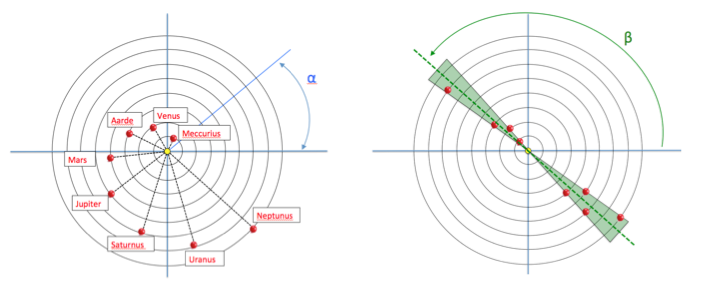

# Solar system

Ons zonnestelsel bestaat uit 8 planeten die elk met een eigen omwentelingssnelheid om de zon draaien. We gaan in deze opgave de positie (de hoek $$\alpha$$) van elk van de planeten berekenen als functie van de tijd. In deze opgave beginnen de planeten allemaal op $$\alpha$$ = 0 en we gaan bepalen hoe vaak het voorkomt dat de planeten ongeveer op 1 lijn staan.

## Opgave 1: positie planeten

Neem stapjes in de tijd en bepaal voor elke stap in de tijd de as (hoek $$\beta$$) waarvoor de planeten het meest gealinieerd zijn. Doe dit door de som van de afwijkingen ($$\Delta_i$$) in hoek tussen $$\beta$$ en die van de individuele planeten te minimaliseren: $$\Delta_{\rm tot} = \Sum_{i}$$.

### Vraag 1a) 

Beschouw Mercurius en Venus en plot $$\Delta_{\rm tot}$$tot als functie van de tijd gedurende 5 jaar. Na hoeveel tijd staan de 2 planeten weer op 1 lijn ? Plot ook $$\beta$$ versus de tijd voor beide planeten in 1 grafiek.

### Vraag 1b)

Zelfde vraag als in a), maar nu met 3 planeten. Neem ook de aarde zelf mee.

### Vraag 1c)
 
Zelfde vraag als in a), maar nu met 8 planeten gedurende 100 jaar.  Wat is de minimale waarde van $$\Delta_{\rm tot}$$ in doe periode ? Teken ook de positie van alle planeten op dat moment op het scherm. 

