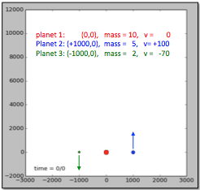
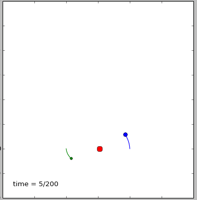
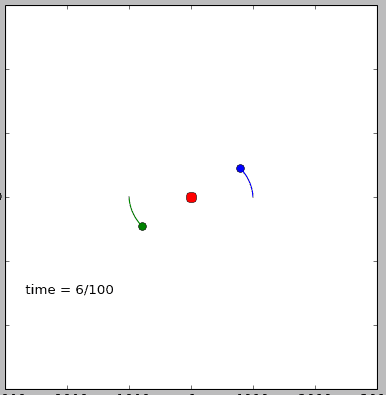

# Kepler

Hoewel je om de beweging van de planeten te beschrijven 'alleen' de zwaartekrachtswet nodig hebt blijkt het ondoenlijk om het analytisch te beschrijven. Alleen met 3 deeltjes is het al onmogelijk. We gaan proberen met behulp van een computerprogramma zelf de beweging van 3 planeten te beschrijven en ook een animatie te maken op het scherm.

Dr kracht tussen 2 deeltjes is gegeven door de bekende zwaartekrachtswet van Newton:
$$F = \alpha\frac{m_i \cdot m_j}{dr_{ij}} $$

Om te zorgen dat we met makkelijke getallen kunnen rekenen (het gaat ons uiteindelijk om de dynamiek van het systeem) kiezen we de volgende getallen:

   - $$\alpha$$ de constante van Newton maal $$10^{16}$$: 
     $$\alpha = 6.67384 \cdot 10^{-11} \cdot 1 \cdot 10^{16} $$
   - deeltje 1 heeft een massa van 10 en begint op (0,0) in stilstand
   - deeltje 2 heeft een massa van  5 en begint op (1000,0) met v = +100   
   - deeltje 2 heeft een massa van  2 en begint op (-1000,0) met v=-70
   

## Opgave 1: positie planeten

Maak een animatie waarbij je de positie en het pad van de drie planeten laat zien. Probeer ook verschillende beginsituaties.

### Tips: 

1) Reken eerst voor elk deeltje uit welke resulterende kracht er op werkt door de kracht van alle andere deeltjes op te tellen. Reken *daarna* pas voor alle deeltjes de nieuwe posities uit.

2) Test je programma door een symmetrische situatie te kiezen en kijk of je systeem ook inderdaad in evenwicht blijft.

