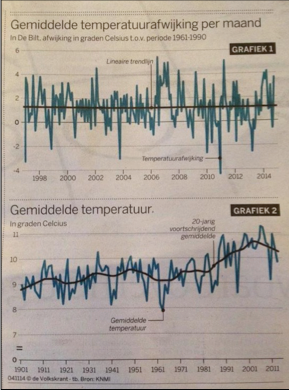

# Klimaatdata

In de opgaves van Module 4, blok 2 hebben we de data die het KNMI heeft verzameld (de temperatuur data per dag vanaf het begin van de 20ste eeuw) geanalyseerd. Het is precies dit soort informatie die in gebruikt wordt in
klimaatdiscussies. Naast de 'droge' data is het belangrijk om trends te ontdekken, te quanticeren en uiteindelijk te duiden.

## Opgave 1: reproduceren klimaat-data in de Volkskrant

In de Volkskrant van 3 november 2014 verschenen de graeken zoals hier rechts staan. Gebruik de data van het KNMI om deze grafieken te reproduceren. 

Ter info: de data bestanden met de temperatuurgegevens zijn hier te downloaden: [data files](https://www.nikhef.nl/~ivov/Python/KlimaatData/)

### Vraag 1a): reproduceren de bovenste grafiek

### Vraag 1b): reproduceer de onderste grafiek

### Vraag 1c): waarom heeft de Volkskrant deze manier gekozen om de data te representeren ?
 

