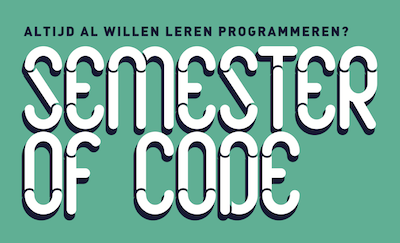

# Inleiding Wetenschappelijk Programmeren <small>Universiteit van Amsterdam / FNWI / Versie 1.0</small>

<!-- Nav tabs -->
<ul class="nav nav-tabs" role="tablist">
<li role="presentation" class="active"><a href="#modules" aria-controls="modules" role="tab" data-toggle="tab">Modules</a></li>
<li role="presentation"><a href="#studiewijzer" aria-controls="studiewijzer" role="tab" data-toggle="tab">Meer info</a></li>
<li role="presentation"><a href="#help" aria-controls="help" role="tab" data-toggle="tab">Help!</a></li>
</ul>

<!-- Tab panes -->

{:.inline}{:style="max-width:30%"}  

Welkom bij deze cursus programmeren! Komende tijd ga je werken met de programmeertaal Python, om te leren wetenschappelijke problemen uit de verschillende bètawetenschappen op te lossen.

De cursus is bedoeld voor mensen die nog helemaal geen ervaring hebben met programmeren. Trouwens: het is ook heel leuk om de cursus met z'n tweeën te doen, dan kun je discussiëren over hoe je de problemen aanpakt.

De cursus bestaat uit vier modules, waarin je steeds meer leert over programmeren, maar vooral hoe je complexe problemen gestructureerd kunt aanpakken. Je kunt voor elke module kiezen uit opgaven rondom verschillende wetenschapsgebieden (zorg dat je voor elke module één van de opties doorlopen hebt!).

De modules zijn steeds opgedeeld in vier dagdelen. Hieronder kun je direct aan de slag door bij elke module één van de opties te kiezen. Wil je meer weten over de cursus? Ga naar "meer info" hierboven.

**Module 1**, kies uit:

- <strong>optie</strong>: piramides tekenen en beklimmen met behulp van [<strong>algoritmen</strong>](/algoritmen/inhoud)

- <strong>optie</strong>: duik in de wereld van [<strong>getaltheorie</strong>](/getaltheorie/inhoud)

**Module 2**, kies uit:

- <strong>optie</strong>: bepaal de [<strong>integraal</strong>](/integreren/inhoud) van ingewikkelde functies

- <strong>optie</strong>: ga op zoek naar het juiste [<strong>DNA</strong>](/dna/inhoud)

**Module 3**, kies uit:

- <strong>optie</strong>: bestudeer de natuurkundige regels van [<strong>beweging</strong>](/beweging/inhoud)

- <strong>optie</strong>: bereken je voordeel bij [<strong>Monopoly</strong>](/monopoly/inhoud)

- <strong>optie</strong>: simuleer populatiedynamica in klassiek [<strong>prooi-predator</strong>](/prooipredator/inhoud) model

**Module 4**, kies uit:

- <strong>optie</strong>: analyseer alle KNMI temperatuur-metingen van de 20ste eeuw: [<strong>Big Data!</strong>](/bigdata/inhoud)

- <strong>optie</strong>: trek harde en minder harde conclusies met behulp van [<strong>statistiek</strong>](/statistiek/inhoud)

## Hulp nodig?

Dit is een online cursus, dus we proberen je zoveel mogelijk via internet te helpen. Dit zijn de mogelijkheden:

- **Mail je vraag** via <help@mprog.nl> (of druk op de blauwe reddingsboei rechtsonder in het scherm). Afhankelijk van de drukte komen we zo snel en uitgebreid mogelijk bij je terug. Heb je een vraag over je code, stuur dan een bestand mee en geef duidelijk aan wat je probleem is.

- Het team achter de cursus zit voor je klaar bij het **inloopspreekuur** op woensdagen van 14-15 uur. Je bent van harte welkom in kantoor C3.204 op Science Park 904.

- Kom langs bij een **practicum** van de Minor Programmeren. Je kunt tot eind mei elke dinsdag t/m donderdag terecht in lokaal A1.16, van 15 tot 19 uur.

## Veelgestelde vragen

**Ik heb nog geen Python, hoe moet dat?**

Tijdens de eerste module leggen we helemaal uit hoe je Python op je eigen computer kunt installeren!

**Ik heb me nog niet aangemeld, mag ik alvast beginnen?**

Zeker! Voel je vrij om de cursus online te doen. Wil je graag hulp hebben met programmeren? Dan moet je je wel aanmelden!

**Ik wil graag meer lesmateriaal of verder leren, waar moet ik zijn?**

Kijk eens naar [deze lijst met Python-resources](https://ocw.mit.edu/courses/electrical-engineering-and-computer-science/6-0001-introduction-to-computer-science-and-programming-in-python-fall-2016/assignments/MIT6_0001F16_additional.pdf) bij MIT!

**Mag ik de cursus hergebruiken voor mijn eigen lessen?**

Ja! Dat is dus precies de bedoeling! Alle bronteksten en andere materialen staan op <https://github.com/uva/betaprog>. Hou ook deze pagina in de gaten: we zullen nog een docentenhandleiding publiceren.

**Kan ik een opdracht bijdragen aan de cursus?**

Heel graag! Neem zeker contact op met de auteurs via <mailto:inleiding@mprog.nl> :-)

## Studiewijzer

Het doel is dat je na de cursus zelf verder kunt leren, en waar nodig, je eigen programmaatjes gaat schrijven om je te helpen tijdens je studie, in het onderzoek of buiten de universiteit. De cursus bestaat uit vier modules en voor elke module kun je kiezen uit meerdere opties. Doe wat je leuk lijkt!

## Aanmelden

Het is niet verplicht om je aan te melden als je de cursus wil bekijken, hergebruiken of gewoon volgen. We vragen je om dit toch te doen, zodat we een beeld hebben van de geïnteresseerden: 
[**vul dit formulier in**](https://docs.google.com/forms/d/e/1FAIpQLSeQ7bMoMXKDO49h2RVElfVX8PjwYJNtD4J6ArC0iAeLKuTIEw/viewform){:target="_blank"}.

We bieden de cursus ook aan als UvA-vak, zodat je bij ons hulp kunt krijgen en een certificaat of studiepunten ontvangen. Wil je dat? Vul dan ook bovenstaand formulier in. We helpen je vervolgens met de officiële inschrijving:

- UvA-studenten kunnen de cursus volgen als normaal vak voor 3 studiepunten (AVV/NAV)
- Medewerkers in dienst kunnen de cursus volgen op kosten van de UvA (we regelen dit voor je)
- Anderen kunnen de cursus volgen voor €300 (semester 2 2017)

## Tentamen

Voor verkrijgen van studiepunten of een certificaat is het nodig om het tentamen te halen. Dit tentamen wordt tweemaal aangeboden in de maand juni 2017 (nadere data volgen).

## Leerdoelen

Wat willen we dat je kunt aan het einde van deze cursus?

- Je kunt een omschrijving van een programma omzetten naar werkende code.
- Je kunt bijgeleverde bibliotheken gebruiken in je eigen programma’s.
- Je kunt code overzichtelijk en beter leesbaar maken door een consistente stijl toe te passen.
- Je kunt bepaalde programmeerfouten opsporen en verbeteren.

Deze dingen kun je alleen maar leren door veel te oefenen met programmeren. Daarom zitten er veel opdrachten in de cursus waar je zelf aan de slag moet. Daarbij is het niet gek als je nog even niet precies weet hoe alles werkt, maar toch de problemen probeert op te lossen.

## Colofon

Deze cursus is gemaakt door Martijn Stegeman (<mailto:martijn@stgm.nl>) en Ivo van Vulpen (<mailto:ivo.van.vulpen@nikhef.nl>) (opdrachten en ontwerp). We hebben veel hulp gehad van studenten en assistenten die de cursus hebben uitgeprobeerd of eigen ideeën bijgedragen. Speciale dank gaat naar:

- Jelle van Assema (opdrachten en checkpy)  
- Marianne de Heer Kloots (revisie en testen)  
- Maarten Inja (DNA-opdracht)  
- Huub Rutjes (films)
- Luca Verhees (artwork semester of code)

Materiaal in deze cursus is gedeeltelijk ontleend aan de volgende creative commons-bronnen:

- 6.189 A Gentle Introduction to Programming Using Python van Sarina Canelake <http://ocw.mit.edu>
- 6.00 Introduction to Computer Science and Programming, Fall 2008 van Eric Grimson en John Guttag <http://ocw.mit.edu>
- CS50 Introduction to Computer Science I van David Malan <http://cs50.tv/>
- 6.0001 Introduction to Computer Science and Programming in Python van Ana Bell, Eric Grimson en John Guttag <http://ocw.mit.edu>
- Think Python van Allen B. Downey <http://greenteapress.com/wp/think-python/>

Voor alle materialen op deze website berust het auteursrecht bij Martijn Stegeman en Ivo van Vulpen. De cursus is in huidige vorm gepubliceerd onder een creative commons-licentie en mag op allerlei manieren hergebruikt worden; zie de link onderaan de pagina.

