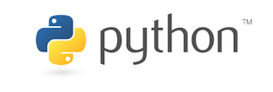

# Inleiding Wetenschappelijk Programmeren <small>Versie 1.0</small>

<!-- Nav tabs -->
<ul class="nav nav-tabs" role="tablist">
<li role="presentation" class="active"><a href="#modules" aria-controls="modules" role="tab" data-toggle="tab">Modules</a></li>
<li role="presentation"><a href="#help" aria-controls="help" role="tab" data-toggle="tab">Help!</a></li>
<li role="presentation"><a href="#studiewijzer" aria-controls="studiewijzer" role="tab" data-toggle="tab">Meer info</a></li>
<li role="presentation"><a href="#vragen" aria-controls="vragen" role="tab" data-toggle="tab">Vragen</a></li>
</ul>

<!-- Tab panes -->

{:.inline}  

Welkom bij deze cursus programmeren! Komende tijd ga je werken met de programmeertaal Python, om te leren wetenschappelijke problemen uit verschillende vakgebieden op te lossen. Hieronder kun je direct aan de slag door bij elke modules één van de opties te kiezen. Wil je meer weten? Ga naar "meer info".

####  Module 1

- Keuze 1: zet je eerste stappen en spring op de pyramide met [<strong>Algoritmen</strong>](/algoritmen/inhoud)

- Keuze 2: duik in de wereld van [<strong>Getaltheorie</strong>](/getaltheorie/inhoud)

####  Module 2

- Keuze 1: [<strong>Integreer</strong>](/integreren/inhoud) zonder moeite de meest exotische functies

- Keuze 2: ga op zoek naar het juiste [<strong>DNA</strong>](/dna/inhoud)

####  Module 3

- Keuze 1: bestudeer de natuurkundige regels van [<strong>beweging</strong>](/beweging/inhoud)

- Keuze 2: bereken je voordeel bij [<strong>Monopoly</strong>](/monopoly/inhoud)

- Keuze 3: simuleer populatiedynamica in klassiek [<strong>prooi-predator</strong>](/prooipredator/inhoud) model

####  Module 4

- Keuze 1: analyseer alle KNMI temperatuur-metingen van de 20ste eeuw: [<strong>Big Data!</strong>](/bigdata/inhoud)

- Keuze 2: conclusies trekken met behulp van [<strong>Statistiek</strong>](/statistiek/inhoud)

## Hulp nodig?

Dit is een online cursus, dus we proberen je zoveel mogelijk via internet te helpen. Dit zijn de mogelijkheden:

- **Mail je vraag** via <help@mprog.nl> (of druk op de blauwe reddingsboei rechtsonder in het scherm). Afhankelijk van de drukte komen we zo snel en uitgebreid mogelijk bij je terug. Heb je een vraag over je code, stuur dan een bestand mee en geef duidelijk aan wat je probleem is.

- Het team achter de cursus zit voor je klaar bij het **inloopspreekuur** op woensdagen van 14-15 uur. Je bent van harte welkom in kantoor C3.204 op Science Park 904.

- Kom langs bij een **practicum** van de Minor Programmeren. Je kunt tot eind mei elke dinsdag t/m donderdag terecht in lokaal A1.16, van 15 tot 19 uur.

## Studiewijzer

Het doel is dat je na de cursus zelf verder kunt leren, en waar nodig, je eigen programmaatjes gaat schrijven om je te helpen tijdens je studie, in het onderzoek of buiten de universiteit. De cursus bestaat uit vier modules en voor elke module kun je kiezen uit meerdere opties. Doe wat je leuk lijkt!

## Aanmelden

[Vul dit formulier in](https://docs.google.com/forms/d/e/1FAIpQLSeQ7bMoMXKDO49h2RVElfVX8PjwYJNtD4J6ArC0iAeLKuTIEw/viewform) om je aan te melden. We nemen daarna contact op om de officiële inschrijving te regelen:

- UvA-studenten kunnen de cursus volgen als vak voor 3 studiepunten (AVV/NAV)
- Medewerkers in dienst kunnen de cursus volgen op kosten van de UvA
- Anderen kunnen de cursus volgen voor €300 (semester 2 2017)

Bij een officiële inschrijving is het mogelijk om begeleiding te krijgen (zie onder) en na halen van het tentamen een certificaat of studiepunten te ontvangen. Het is natuurlijk ook mogelijk om niet in te schrijven maar de cursus te gebruiken en de opdrachten te doen! Meld je dan alsjeblieft alsnog aan via het formulier.

## Tentamen

Voor verkrijgen van studiepunten of een certificaat is het nodig om het tentamen te halen. Dit tentamen wordt tweemaal aangeboden in de maand juni 2017 (nadere data volgen).

## Leerdoelen

Wat willen we dat je kunt aan het einde van deze cursus?

- Je kunt een omschrijving van een programma omzetten naar werkende code.
- Je kunt bijgeleverde bibliotheken gebruiken in je eigen programma’s.
- Je kunt code overzichtelijk en beter leesbaar maken door een consistente stijl toe te passen.
- Je kunt bepaalde programmeerfouten opsporen en verbeteren.

Deze dingen kun je alleen maar leren door veel te oefenen met programmeren. Daarom zitten er veel opdrachten in de cursus waar je zelf aan de slag moet. Daarbij is het niet gek als je nog even niet precies weet hoe alles werkt, maar toch de problemen probeert op te lossen.

## Colofon

Martijn Stegeman (opdrachten en ontwerp)  
Ivo van Vulpen (opdrachten en ontwerp)  
Jelle van Assema (opdrachten en ontwerp)  
Maarten Inja (DNA-opdracht)  
Huub Rutjes (films)

Materiaal in deze cursus is gedeeltelijk ontleend uit de volgende creative commons-bronnen:

- 6.189 A Gentle Introduction to Programming Using Python van Sarina Canelake <http://ocw.mit.edu>
- 6.00 Introduction to Computer Science and Programming, Fall 2008 van Eric Grimson en John Guttag <http://ocw.mit.edu>
- CS50 Introduction to Computer Science I van David Malan <http://cs50.tv/>
- 6.0001 Introduction to Computer Science and Programming in Python van Ana Bell, Eric Grimson en John Guttag <http://ocw.mit.edu>
- Think Python van Allen B. Downey <http://greenteapress.com/wp/think-python/>

Deze cursus is zelf ook gepubliceerd onder een creative commons-licentie en mag op allerlei manieren hergebruikt worden; zie de link onderaan de pagina.

### Ik wil graag meer lesmateriaal of verder leren, waar moet ik zijn?

Kijk eens naar [deze lijst met Python-resources](https://ocw.mit.edu/courses/electrical-engineering-and-computer-science/6-0001-introduction-to-computer-science-and-programming-in-python-fall-2016/assignments/MIT6_0001F16_additional.pdf) bij MIT!

